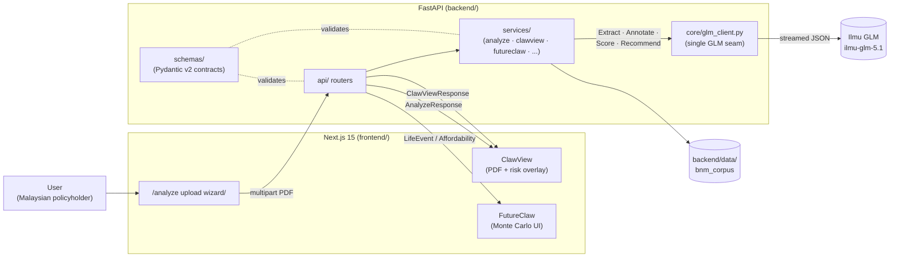
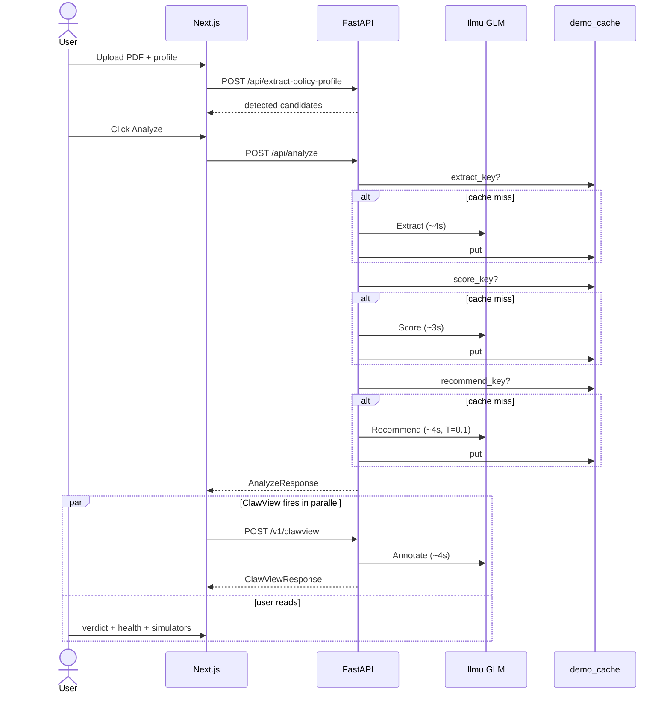
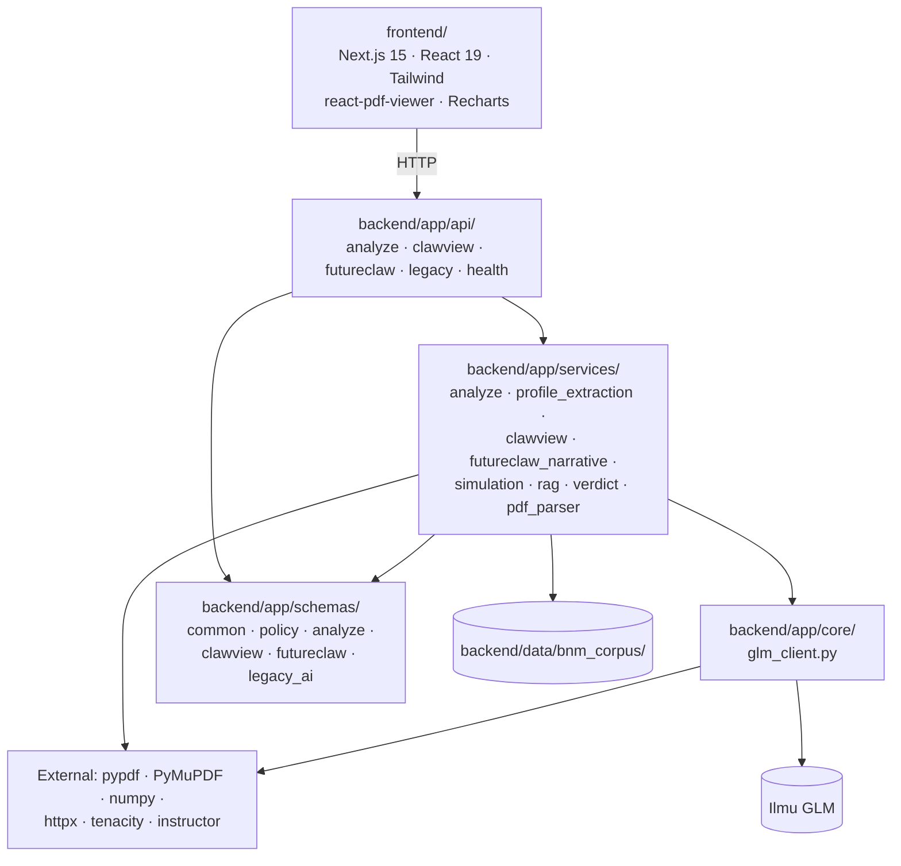

# Architecture

PolicyClaw is a two-tier app: Next.js 15 frontend talking to a FastAPI backend
that orchestrates **four GLM calls** against an authorized Z.AI endpoint
(`api.ilmu.ai/v1`, model `ilmu-glm-5.1`). This document is the 3-minute read
for engineers and judges. For product scope see [`PRD.md`](PRD.md); for
deeper system context see [`SAD.md`](SAD.md); for QA strategy see
[`QATD.md`](QATD.md).

---

## 1. System diagram



Key property: **every GLM request in the system passes through
`backend/app/core/glm_client.py`.** Swapping providers or adjusting retry
behavior is a one-file change.

---

## 2. The four-call GLM pipeline

`/api/analyze` runs the first three calls sequentially. The fourth
(`Annotate` for ClawView) is served by `/v1/clawview` and fired by the
frontend in parallel with user review of the verdict, so the perceived
end-to-end latency target of **≤15s** is achievable.

| Stage        | Call         | Endpoint               | Temp | Output                                          | Fallback                         |
|--------------|--------------|------------------------|------|-------------------------------------------------|----------------------------------|
| 1. Extract   | `analyze_policy_xray`    | `/api/analyze` (internal) | 0.2  | `PolicyXRayResponse` — typed clauses, gotchas   | `_mock_policy_xray` (deterministic) |
| 2. Annotate  | `annotate_policy`        | `/v1/clawview`            | 0.2  | `ClawViewResponse` — per-clause risk + bboxes   | heuristic keyword match          |
| 3. Score     | `analyze_health_score`   | `/api/analyze` (internal) | 0.2  | `HealthScore` — 4 sub-scores, EN+BM narrative   | `_heuristic_health_score`        |
| 4. Recommend | `analyze_policy_verdict` | `/api/analyze` (internal) | 0.1  | `PolicyVerdict` — Keep/Switch/Dump + reasons    | `_heuristic_policy_verdict`      |

Each call is wrapped in a streamed POST with 3-attempt exponential-backoff
retry (see `core.glm_client.post_glm_with_retry`) and a per-call
`demo_cache` read-through so identical inputs yield identical outputs
(F7 verdict-consistency requirement).

### Sequence view



---

## 3. LLM as a service layer

The core design rule: **feature code never talks to the GLM HTTP endpoint
directly.** It calls a thin module in `app.core.glm_client`:

```text
backend/app/core/glm_client.py
├── load_local_env()              # loads backend/.env idempotently
├── AIServiceConfig               # resolves GLM_API_KEY / GLM_API_BASE / GLM_MODEL
├── config: AIServiceConfig       # process-wide singleton
├── confidence_band_from_score()  # shared scorer → HIGH / MEDIUM / LOW
├── extract_json_from_content()   # tolerates ```json fences
├── post_glm_with_retry()         # streamed POST w/ 3-attempt backoff
└── GLMClient                     # optional object handle (chat_url, headers, complete_json)
```

Why this matters:

1. **Single point of change** — if Ilmu moves endpoints, rotates auth, or the
   hackathon organizers approve a new Z.AI model, one file updates.
2. **Testable seam** — tests swap `ai_service.config = AIServiceConfig()`
   after setting env vars (see `tests/test_orchestrator.py`), and every
   feature path respects the change.
3. **Mock mode is free** — when `GLM_API_KEY` is absent, `config.is_mock_mode`
   is true and every service falls back to its deterministic mock. The demo
   flow runs end-to-end without a live key.
4. **Feature prompts stay with the feature** — ClawView's prompt lives in
   `services/clawview_service.py`, the verdict prompt in
   `services/ai_service.py`. The client doesn't grow a god-method.

---

## 4. Dependency map



The arrow direction is strict: `api → services → core`. `schemas` is
imported by all three but imports nothing from them, so it stays acyclic.

---

## 5. What lives where (quick tour)

| Path                                   | Responsibility                                          |
|----------------------------------------|---------------------------------------------------------|
| `backend/app/main.py`                  | FastAPI app instance + CORS + `include_router` calls   |
| `backend/app/api/`                     | HTTP surface; one module per feature concern           |
| `backend/app/services/`                | Business logic; owns GLM prompts and fallbacks         |
| `backend/app/core/glm_client.py`       | The only place that opens an `httpx.AsyncClient` to Ilmu |
| `backend/app/schemas/`                 | Pydantic v2 request/response contracts                  |
| `backend/data/bnm_corpus/`             | Static BNM / LIAM / PIAM / MTA cost + rights corpus    |
| `backend/tests/`                       | 33 pytest tests (unit + orchestrator + verdict consistency) |
| `evals/`                               | JSON-driven pass/fail harness for the 4 GLM stages     |
| `frontend/app/analyze/`                | Upload wizard + results UI                              |
| `docs/erd.md`                          | Mermaid ERD of the Pydantic data model                  |

---

## 6. Further reading

- [`PRD.md`](PRD.md) — product requirements, scope, NFRs (authoritative spec)
- [`SAD.md`](SAD.md) — system architecture document (deeper than this file)
- [`QATD.md`](QATD.md) — quality assurance & test design
- [`AI_INTEGRATION_GUIDE.md`](AI_INTEGRATION_GUIDE.md) — how to wire real GLM
  responses into the scaffolded `/v1/ai/*` family
- [`docs/erd.md`](docs/erd.md) — entity-relationship diagram of the data model
- [`evals/README.md`](evals/README.md) — how to run the GLM eval harness
