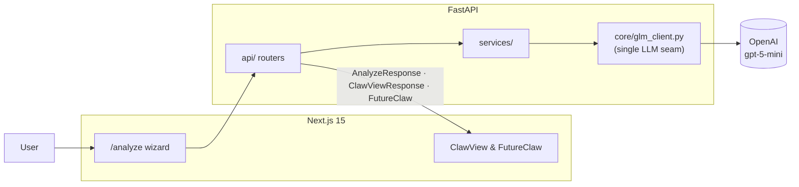
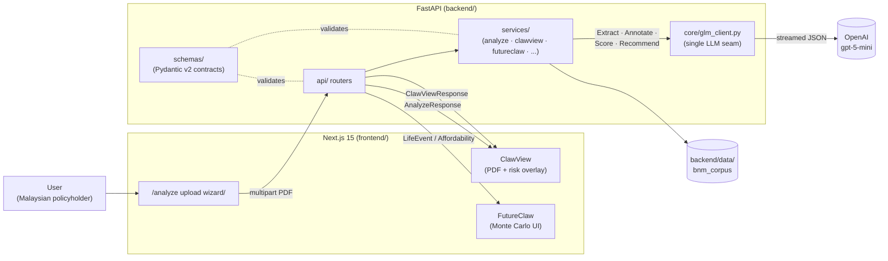
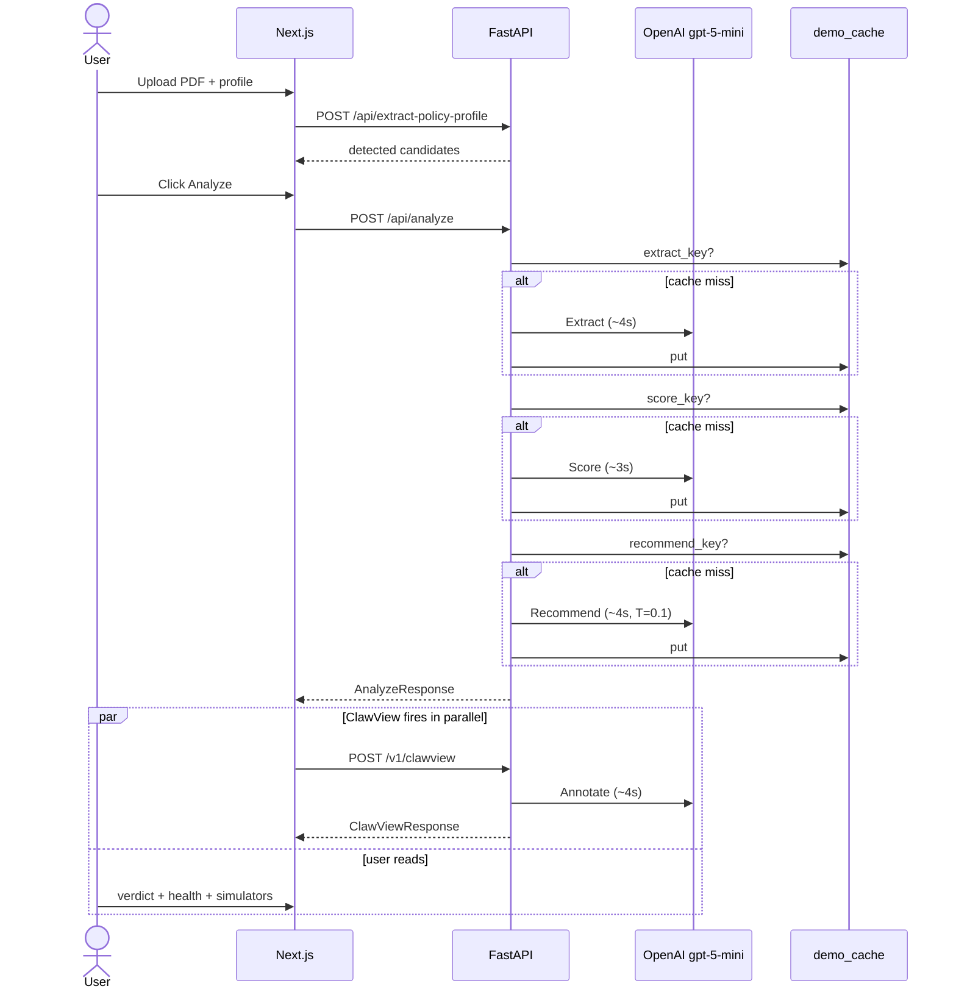
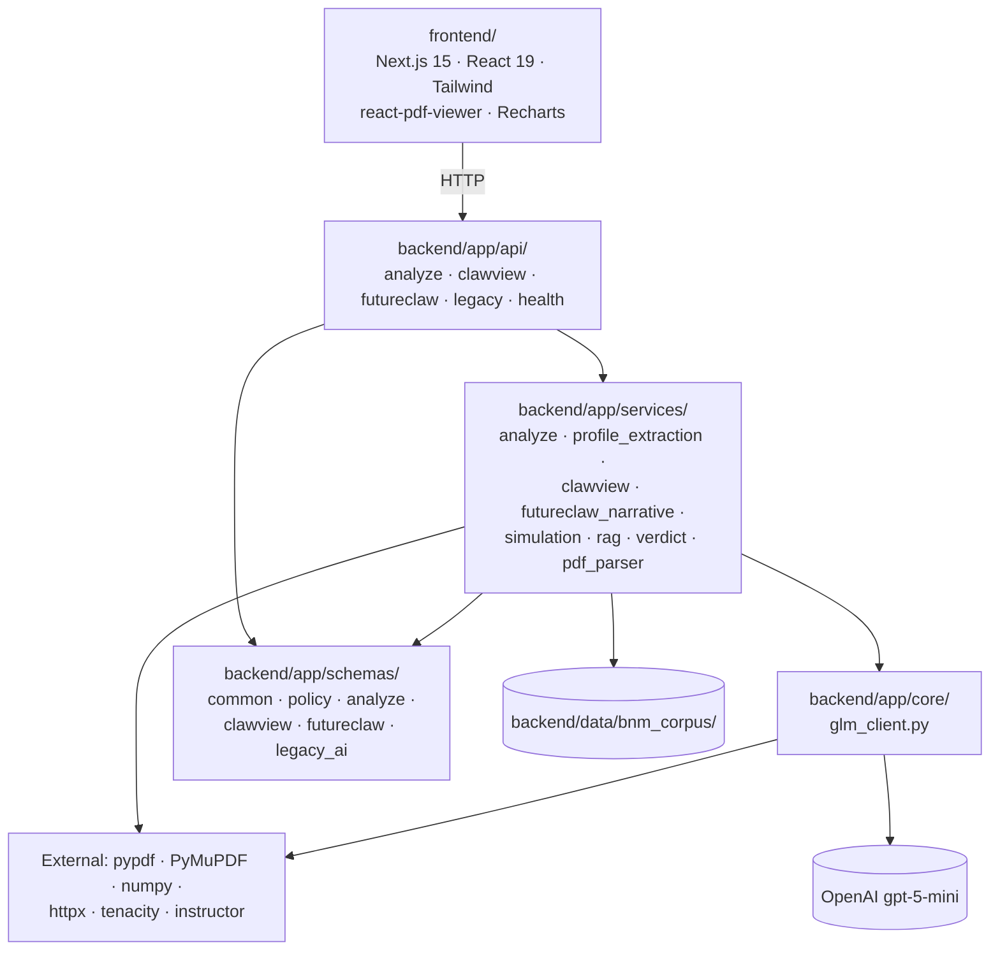

# PolicyClaw

[](https://github.com/xrwong00/policyclaw/actions/workflows/ci.yml)

**Claw back control from policy confusion.**

PolicyClaw is an AI decision-intelligence product that turns dense insurance PDFs into clear, evidence-backed recommendations. Upload a policy and in minutes see what you are paying for, where coverage overlaps, which rights you can act on, and whether to **Keep**, **Switch**, **Downgrade**, or **Dump**.

Built for **UMHackathon 2026** — Domain 2: AI for Economic Empowerment & Decision Intelligence.

---

## Table of contents

- [Problem](#problem)
- [Solution](#solution)
- [Target users & user stories](#target-users--user-stories)
- [Key features](#key-features)
- [How it works](#how-it-works)
- [Architecture](#architecture)
  - [System diagram](#system-diagram)
  - [The four-call LLM pipeline](#the-four-call-llm-pipeline)
  - [Sequence view](#sequence-view)
  - [LLM as a service layer](#llm-as-a-service-layer)
  - [Dependency map](#dependency-map)
  - [What lives where](#what-lives-where)
- [Data model](#data-model)
- [Tech stack](#tech-stack)
- [Project structure](#project-structure)
- [Setup](#setup)
- [API surface](#api-surface)
- [Makefile targets](#makefile-targets)
- [Testing strategy](#testing-strategy)
- [Risks & mitigations](#risks--mitigations)
- [Why this matters](#why-this-matters)
- [Further reading](#further-reading)
- [Disclaimer](#disclaimer)

---

## Problem

Malaysian policyholders face a decision-paralysis problem:

- Policy documents are long, technical, and hard to compare.
- Benefits and exclusions are easy to miss.
- Policy overlap creates hidden waste.
- Most users do not know their rights under BNM guidance.
- A 2024 repricing wave hit 9% of MHIT policyholders with annual hikes >40% (BNM 2024 Annual Report); interim BNM measures cap hikes at 10% through **31 December 2026**, but most policyholders don't know they qualify.
- **30 million underinsured Malaysians** (EY Malaysia 2024) — the root cause is decision paralysis, not affordability.

The result is poor decisions made under uncertainty: overpaying, underprotected coverage, and delayed action.

## Solution

PolicyClaw combines document understanding and AI reasoning into one decision flow:

1. Ingest policy PDF(s) and extract structured policy details.
2. Retrieve relevant evidence chunks from source documents.
3. Run AI analysis for coverage quality, overlap risk, and rights detection.
4. Return a final verdict with confidence and citations.

This is decision support, not blind automation: users review and edit extracted fields before analysis, and every recommendation ships with a confidence score and source citations.

---

## Target users & user stories

PolicyClaw is built for Malaysian policyholders facing a decision moment — a repricing notice, a new rider offer, or a life event that changes coverage needs. The PRD names three representative personas; each maps to a concrete job-to-be-done the product must serve within a single 24-hour solo-dev MVP.

| Persona | Context | Job-to-be-done |
|---|---|---|
| **Aisyah, 38 — M40 marketing manager, KL** | 2–4 active policies; just received a 30%+ repricing notice with 30 days to respond. | "Tell me whether to keep, downgrade, or switch this policy, and show me the clauses that prove it." |
| **Uncle Lim, 58 — near-retirement multi-language user** | Has held the same medical plan 20 years; worried about premium affordability at retirement. | "Project my premiums for the next 10 years against my income, in Bahasa Malaysia — and flag the year I can no longer afford it." |
| **Siti, 32 — takaful-first, Shariah-conscious** | Shopping across conventional and takaful products; unsure if coverage overlaps. | "Compare my two plans side-by-side and tell me if I'm paying for duplicated protection." |

Every feature in §[Key features](#key-features) traces back to at least one of these stories. Any feature that does not — regardless of technical elegance — is out of scope for the 24-hour MVP. See [`PRD.md`](PRD.md) §2 for the authoritative spec.

---

## Key features

### ClawView — risk overlay on the actual PDF
Color-coded clause risk (green / yellow / red) rendered directly over the uploaded policy using per-clause bounding boxes. Click any highlight for a plain-language explanation and a citation back to the exact clause. This is the visual demo moment.

### FutureClaw — 10-year interactive simulator
Monte Carlo simulation with two toggleable modes:
- **Affordability:** premium vs income trajectory across optimistic / realistic / pessimistic scenario bands.
- **Life Event:** four scenarios (Cancer, Heart Attack, Disability, Death of primary earner) with covered / co-pay / out-of-pocket breakdowns and LLM-generated narratives in **EN + BM**.

### Policy X-Ray
Transforms complex policy text into a clear summary of plan type, premium, coverage limit, dates, and riders.

### Overlap Detection
Identifies duplicate or unnecessary coverage across policy documents to surface avoidable spend.

### BNM Rights Scanner
Flags relevant Bank Negara Malaysia consumer-rights signals found in policy wording — including the interim 10% annual-hike cap running through 31 December 2026.

### Verdict Engine
Outputs a direct action recommendation — **Keep**, **Switch**, **Downgrade**, or **Dump** — with reasons, confidence score, projected MYR impact, and supporting citations.

---

## How it works

1. **Upload PDF(s):** User uploads one or more insurance policies.
2. **Auto-extraction:** Backend extracts candidate policy profiles and auto-fills fields.
3. **Human review:** User confirms or edits values (including required monthly income).
4. **AI analysis:** Four LLM calls run against the uploaded content:
   - **Extract** — raw text → structured `Policy` model
   - **Annotate** — each clause → risk level + explanation (drives ClawView)
   - **Score** — sub-scores for Coverage, Affordability, Stability, Clarity (drives Health Score)
   - **Recommend** — all of the above + simulation results → Verdict + Reasons + Confidence + Citations
5. **Decision output:** UI presents verdict, projected savings, overlap/rights signals, ClawView overlay, and FutureClaw projections.



---

## Architecture

PolicyClaw is a two-tier app: a Next.js 15 frontend talking to a FastAPI backend that orchestrates **four LLM calls** against OpenAI (`api.openai.com/v1`, model `gpt-5-mini`). For product scope see [`PRD.md`](PRD.md); for QA strategy see [`QATD.md`](QATD.md); for the full system architecture document (NFRs, capacity planning, failure modes) see [`SAD.md`](SAD.md).

### System diagram



**Key property:** every LLM request in the system passes through `backend/app/core/glm_client.py`. Swapping providers or adjusting retry behavior is a one-file change.

### The four-call LLM pipeline

`/api/analyze` runs the first three calls sequentially. The fourth (`Annotate` for ClawView) is served by `/v1/clawview` and fired by the frontend in parallel with user review of the verdict, so the perceived end-to-end latency target of **≤15s** is achievable.

| Stage        | Call                     | Endpoint                  | Temp | Output                                          | Fallback                            |
|--------------|--------------------------|---------------------------|------|-------------------------------------------------|-------------------------------------|
| 1. Extract   | `analyze_policy_xray`    | `/api/analyze` (internal) | 0.2  | `PolicyXRayResponse` — typed clauses, gotchas   | `_mock_policy_xray` (deterministic) |
| 2. Annotate  | `annotate_policy`        | `/v1/clawview`            | 0.2  | `ClawViewResponse` — per-clause risk + bboxes   | heuristic keyword match             |
| 3. Score     | `analyze_health_score`   | `/api/analyze` (internal) | 0.2  | `HealthScore` — 4 sub-scores, EN+BM narrative   | `_heuristic_health_score`           |
| 4. Recommend | `analyze_policy_verdict` | `/api/analyze` (internal) | 0.1  | `PolicyVerdict` — Keep/Switch/Dump + reasons    | `_heuristic_policy_verdict`         |

Each call is wrapped in a streamed POST with exponential-backoff retry (`core.glm_client.post_glm_with_retry` — default 3 attempts / 120s read timeout, overridable per call: ClawView's Annotate uses 2 attempts / 30s so it falls back to the heuristic mock fast) and a per-call `demo_cache` read-through so identical inputs yield identical outputs (F7 verdict-consistency requirement).

> The `Temp` column above shows what the caller requests, but `gpt-5-mini` (and other gpt-5 / o-series reasoning models) reject custom `temperature`. The shared client strips it and injects `reasoning_effort: "low"` automatically (`backend/app/core/glm_client.py:_adapt_payload_for_provider`).

### Sequence view



### LLM as a service layer

The core design rule: **feature code never talks to the LLM HTTP endpoint directly.** It calls a thin module in `app.core.glm_client`:

```text
backend/app/core/glm_client.py
├── load_local_env()                 # loads backend/.env idempotently
├── AIServiceConfig                  # resolves OPENAI_API_KEY / OPENAI_API_BASE / OPENAI_MODEL
├── config: AIServiceConfig          # process-wide singleton
├── confidence_band_from_score()     # shared scorer → HIGH / MEDIUM / LOW
├── extract_json_from_content()      # tolerates ```json fences
├── _adapt_payload_for_provider()    # strips temperature/top_p, injects reasoning_effort for gpt-5/o1/o3
├── post_glm_with_retry()            # streamed POST w/ backoff retries (per-call timeout + attempts)
└── GLMClient                        # optional object handle (chat_url, headers, complete_json)
```

Why this matters:

1. **Single point of change** — when the project swapped providers from Ilmu GLM to OpenAI `gpt-5-mini`, only this file (plus env-var renames in services) needed editing. Future swaps are equally cheap.
2. **Testable seam** — tests swap `ai_service.config = AIServiceConfig()` after setting env vars (see `backend/tests/test_orchestrator.py`), and every feature path respects the change.
3. **Mock mode is free** — when `OPENAI_API_KEY` is absent, `config.is_mock_mode` is true and every service falls back to its deterministic mock. The demo flow runs end-to-end without a live key.
4. **Feature prompts stay with the feature** — ClawView's prompt lives in `services/clawview_service.py`, the verdict prompt in `services/ai_service.py`. The client doesn't grow a god-method.

### Dependency map



The arrow direction is strict: `api → services → core`. `schemas` is imported by all three but imports nothing from them, so it stays acyclic.

### What lives where

| Path                                   | Responsibility                                           |
|----------------------------------------|----------------------------------------------------------|
| `backend/app/main.py`                  | FastAPI app instance + CORS + `include_router` calls     |
| `backend/app/api/`                     | HTTP surface; one module per feature concern             |
| `backend/app/services/`                | Business logic; owns LLM prompts and fallbacks           |
| `backend/app/core/glm_client.py`       | The only place that opens an `httpx.AsyncClient` to the LLM provider |
| `backend/app/schemas/`                 | Pydantic v2 request/response contracts                   |
| `backend/data/bnm_corpus/`             | Static BNM / LIAM / PIAM / MTA cost + rights corpus      |
| `backend/tests/`                       | 38 pytest tests (unit + orchestrator + verdict consistency) |
| `evals/`                               | JSON-driven pass/fail harness for the 4 LLM stages       |
| `frontend/app/analyze/`                | Upload wizard + results UI                               |
| `docs/erd.md`                          | Mermaid ERD of the Pydantic data model                   |

---

## Data model

Every API boundary is typed with Pydantic v2 models. The core request/response contracts live in [`backend/app/schemas/`](backend/app/schemas) and the full entity-relationship diagram is in [`docs/erd.md`](docs/erd.md). The key types a judge or contributor will encounter:

- **`PolicyInput`** — user-supplied profile (insurer, plan, premium, coverage, age, income).
- **`PolicyXRayResponse`** — structured extraction output with typed `PolicyClause[]`, gotcha count, and confidence.
- **`HealthScore`** — overall 0–100 score plus four sub-scores (coverage adequacy, affordability, premium stability, clarity & trust) with EN + BM narratives.
- **`PolicyVerdict`** — `keep | downgrade | switch | dump`, confidence band, 10-year MYR impact, and `Reason[]` with `Citation`.
- **`ClawViewResponse`** — per-clause risk annotations with PyMuPDF bounding boxes; invariant `red + yellow + green == len(annotations)` is enforced by Pydantic validators.
- **`PremiumSimulationResponse`** / **`LifeEventSimulationResponse`** — exactly 3 affordability scenarios (optimistic / realistic / pessimistic) and exactly 4 life-event scenarios (cancer / heart attack / disability / death).

Shared enums (`PolicyType`, `ConfidenceBand`, `VerdictLabel`, `RiskLevel`, `LifeEvent`) live in `schemas/common.py` and are reused across modules. See [`docs/erd.md`](docs/erd.md) for the class diagrams and cardinalities.

---

## Tech stack

- **Frontend:** Next.js 15.3.2 (App Router), React 19.0.0, TypeScript 5.8.3, Tailwind CSS 4.2.4, Recharts 3.8.1, Framer Motion 12.38.0, Zustand 5.0.12, TanStack Query 5.100.1, `@react-pdf-viewer/core` 3.12.0, jsPDF 2.5.2, pdfjs-dist 3.11.174.
- **Backend:** Python 3.10+ (3.12 recommended and used by CI), FastAPI 0.115.12, Pydantic 2.11.4, numpy 2.2.5, scipy 1.16.1, httpx 0.28.1, tenacity 9.1.2, instructor 1.15.1.
- **PDF processing:** pypdf 5.4.0 for text extraction, PyMuPDF (fitz) 1.26.4 for per-clause bounding boxes used by ClawView.
- **LLM:** OpenAI `gpt-5-mini` at `https://api.openai.com/v1`. The project initially targeted Z.AI GLM via Ilmu (`api.ilmu.ai` / `ilmu-glm-5.1`) to satisfy the rubric's mandatory-Z.AI rule, but the Ilmu gateway proved unstable and the organizers waived the Z.AI requirement for this submission.
- **Storage:** in-memory backend state + browser `localStorage` for MVP; file-based `demo_cache` for deterministic replay. Supabase (Postgres + Auth + Storage + pgvector) is a post-MVP target, explicitly flagged in PRD §9.2 / §10.3 as *not MVP-gating*.
- **Testing:** pytest 8.3.4 + pytest-asyncio 0.25.2 on the backend; `next lint` + `tsc` on the frontend.
- **CI:** GitHub Actions on every push / PR — backend smoke-import + pytest, frontend install + build; ruff and ESLint run informationally. See [`.github/workflows/ci.yml`](.github/workflows/ci.yml).

---

## Project structure

- [PRD.md](PRD.md) — product requirements and scope (authoritative spec)
- [SAD.md](SAD.md) — system architecture document
- [QATD.md](QATD.md) — QA and test design document
- [AI_INTEGRATION_GUIDE.md](AI_INTEGRATION_GUIDE.md) — how to wire LLM-backed endpoints
- [docs/erd.md](docs/erd.md) — Mermaid ERD of the Pydantic data model
- [backend/](backend) — FastAPI service (`api/` routers, `services/`, `core/glm_client.py`, `schemas/`)
- [frontend/](frontend) — Next.js product interface
- [evals/](evals) — JSON-driven LLM pipeline eval harness (`python evals/run.py`)
- [Makefile](Makefile) — judge- and CI-friendly command surface
- [.github/workflows/ci.yml](.github/workflows/ci.yml) — CI pipeline (pytest + frontend build on every push/PR)

---

## Setup

### Prerequisites

- Python 3.10+ (3.12 recommended)
- Node.js 20+

### 1) Backend dependencies

The backend uses a venv at `backend/.venv/`. Install and run from `backend/` with the venv activated:

```bash
cd backend
python -m venv .venv           # first time only
# macOS/Linux:
source .venv/bin/activate
# Windows PowerShell:
.venv\Scripts\Activate.ps1

pip install -r requirements.txt
```

Do **not** install requirements against the system Python — uvicorn loads from `backend/.venv` and will throw `ModuleNotFoundError` (e.g. `tenacity`) if deps go elsewhere.

### 2) Backend environment

Copy the committed template and fill in your key:

```bash
cp backend/.env.example backend/.env
# edit backend/.env and set OPENAI_API_KEY=...
```

Without `OPENAI_API_KEY`, the backend falls back to mock LLM responses — the flow still runs end-to-end but outputs are synthetic. `backend/.env` is gitignored; `backend/.env.example` is the committed template.

### 3) Run backend

From `backend/` with the venv activated (continuing from §1):

```bash
uvicorn app.main:app --reload
```

Do **not** add `--app-dir backend` when cwd is already `backend/` — it doubles the path and fails with `No module named 'app'`. Equivalent from the repo root: `backend/.venv/Scripts/python -m uvicorn app.main:app --app-dir backend --reload`.

- API: http://127.0.0.1:8000
- Docs: http://127.0.0.1:8000/docs
- Health: http://127.0.0.1:8000/health

### 4) Frontend

```bash
cd frontend
npm install
npm run dev
```

- App: http://127.0.0.1:3000
- Main flow: http://127.0.0.1:3000/analyze

---

## API surface

### Core flow

- `POST /api/extract-policy-profile` — extract structured `PolicyProfile` candidate(s) from uploaded PDF(s)
- `POST /api/analyze` — full analysis → verdict, reasons, confidence, and citations

### Wow-factor endpoints

- `POST /v1/clawview` — ClawView clause-level risk overlay (drives the PDF highlight layer)
- `POST /v1/simulate/affordability` — FutureClaw Monte Carlo premium projection, 3 scenario bands over 10 years
- `POST /v1/simulate/life-event` — FutureClaw life-event scenarios with LLM-generated narratives (EN + BM)

### Scaffolded / legacy

- `GET /health`
- `POST /v1/policies/upload`
- `POST /v1/simulate/premium`
- `POST /v1/verdict`
- `/v1/ai/*` family (policy-xray, overlap-map, bnm-rights-scanner, voice-interrogation, multilingual-explainer, citations, status) — several return mock data; check `backend/app/api/legacy.py` before depending on them.

---

## Makefile targets

The root [`Makefile`](Makefile) exposes the commands judges / CI should run:

| Target             | What it does                                                           |
|--------------------|------------------------------------------------------------------------|
| `make install`     | `pip install -r backend/requirements.txt` + `npm ci --prefix frontend` |
| `make dev-backend` | Start FastAPI on `127.0.0.1:8000` with auto-reload                     |
| `make dev-frontend`| Start Next.js on `127.0.0.1:3000` with hot reload                      |
| `make test`        | `pytest backend/tests/ -q`                                             |
| `make lint`        | `ruff check backend/` + `npm run lint --prefix frontend`               |
| `make evals`       | `python evals/run.py` — 12-case LLM-pipeline harness                   |
| `make build`       | `npm run build --prefix frontend`                                      |
| `make ci-local`    | test + lint + build + evals (mirrors `.github/workflows/ci.yml`)       |

On Windows the Makefile runs under **Git Bash** (targets use bash syntax, not PowerShell).

---

## Testing strategy

Three layers of automated verification run on every push and PR.

### 1. Unit + integration tests (pytest)

**38 tests across 6 suites** in [`backend/tests/`](backend/tests). Run with `pytest backend/tests/ -q` or `make test`.

| Suite                          | Tests | Covers                                                                 |
|--------------------------------|------:|------------------------------------------------------------------------|
| `test_extraction.py`           |     2 | Policy X-Ray extraction pipeline and field accuracy                    |
| `test_orchestrator.py`         |     8 | End-to-end `/api/analyze` flow, stage sequencing, mock/real parity     |
| `test_simulation.py`           |     2 | Monte Carlo affordability + life-event numeric correctness             |
| `test_verdict_consistency.py`  |     8 | Verdict heuristic bounds, confidence bands, F7 reproducibility         |
| `test_futureclaw.py`           |    15 | Affordability scenario ordering, narrative batch, confidence, mocks    |
| `test_clawview.py`             |     3 | Clause annotation, risk-count invariants, confidence scoring           |

### 2. LLM pipeline evals

A **12-case JSON-driven eval harness** in [`evals/`](evals) covers all four LLM stages (Extract, Score, Recommend, plus the two simulators). Cases live in `evals/cases.json`; results write to `evals/results.md`. The harness intentionally runs with `OPENAI_API_KEY` unset so the deterministic mock paths execute — this means a failing eval always points to a logic regression, not an upstream LLM flake. Exit 0 if ≥85% of cases pass, else 1.

Run with `python evals/run.py` or `make evals`.

Coverage distribution:

| Stage         | Cases | Assertions include                                                             |
|---------------|------:|--------------------------------------------------------------------------------|
| Extract       |     3 | happy path, policy_id echoing, gotcha count in range                           |
| Score         |     3 | sub-scores in [0, 25], overall ≤ 95, non-empty EN + BM narrative               |
| Recommend     |     3 | valid verdict label, ≥2 reasons each with a citation, non-negative savings     |
| Life Event    |     2 | exactly 4 scenarios, `covered ≤ total_event_cost` per scenario                 |
| Affordability |     1 | exactly 3 scenarios, `optimistic ≤ realistic ≤ pessimistic` cumulative premium |

### 3. Continuous integration

[`.github/workflows/ci.yml`](.github/workflows/ci.yml) runs on every push and PR to every branch with `cancel-in-progress` concurrency per ref:

- **Backend** (Python 3.12): install deps, smoke-import `app.main`, run pytest, ruff (informational).
- **Frontend** (Node 20): install deps, ESLint (informational), `next build`.

`make ci-local` runs the same pipeline locally before pushing.

### Determinism guarantee

`backend/app/services/demo_cache.py` provides a SHA-256-keyed read-through cache for each LLM stage. When `demo_cache_enabled`, identical inputs always produce identical outputs — this is what lets F7 (verdict consistency across 3 reruns) pass on judged hardware regardless of upstream latency or retries.

---

## Risks & mitigations

| Risk                                             | Mitigation                                                                                                                                                                                    |
|--------------------------------------------------|-----------------------------------------------------------------------------------------------------------------------------------------------------------------------------------------------|
| LLM latency spike or gateway outage              | `post_glm_with_retry` streams SSE with exponential-backoff retry; per-call timeout overrides (ClawView: 2 attempts / 30s); every service has a deterministic heuristic fallback (`_mock_*`).  |
| Hallucinated claims from the LLM                 | P2 "explain or don't say it" — every AI output carries a citation back to the source clause; every output has a 0–100% confidence score; low-confidence branches route the user to a human advisor. |
| PDF parsing edge cases (scanned docs, tables)    | PyMuPDF is used for bbox-critical ClawView paths; pypdf is the text-only fallback; mock mode ships with pre-rendered fixtures so scanned PDFs never block the demo flow.                     |
| Live LLM failure during the judged demo          | `demo_cache` read-through guarantees identical inputs → identical outputs; mock mode (`OPENAI_API_KEY` unset) runs the full end-to-end flow with synthetic but consistent outputs.            |
| 24-hour solo-dev scope creep                     | PRD §5 locks the 4-LLM-call pipeline and the P0/P1 feature table; anything outside is explicitly post-MVP (Supabase persistence, auth, voice, additional languages).                           |
| Hackathon Z.AI eligibility                       | The original Z.AI mandate was waived by the organizers after the Ilmu gateway proved unstable. The `glm_client.py` seam means future provider swaps remain a one-file config change.          |
| Regulatory / advice liability                    | Every recommendation screen carries a `disclaimer` field enforced in `PolicyVerdict`; product copy repeats "decision support, not licensed financial advice."                                 |

See [`QATD.md`](QATD.md) for the full risk register with likelihood × impact scoring.

---

## Why this matters

PolicyClaw converts insurance from a trust-heavy black box into a transparent decision system. Faster, clearer, and more defensible policy decisions for everyday policyholders — especially the 30M underinsured Malaysians for whom decision paralysis, not affordability, is the real blocker.

---

## Further reading

- [`PRD.md`](PRD.md) — product requirements, scope, NFRs (authoritative spec)
- [`SAD.md`](SAD.md) — system architecture document (NFRs, capacity, failure modes)
- [`QATD.md`](QATD.md) — quality assurance & test design, full risk register
- [`AI_INTEGRATION_GUIDE.md`](AI_INTEGRATION_GUIDE.md) — how to wire real LLM responses into the scaffolded `/v1/ai/*` family
- [`docs/erd.md`](docs/erd.md) — entity-relationship diagram of the Pydantic data model
- [`evals/README.md`](evals/README.md) — how to run the LLM eval harness

---

## Disclaimer

PolicyClaw provides decision support only and is not licensed financial advice.
