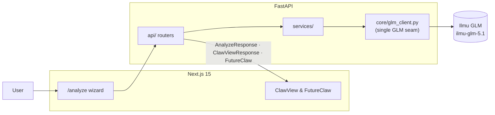

# PolicyClaw

[](https://github.com/xrwong00/policyclaw/actions/workflows/ci.yml)

**Claw back control from policy confusion.**

PolicyClaw is an AI decision-intelligence product that turns dense insurance PDFs into clear, evidence-backed recommendations. Upload a policy and in minutes see what you are paying for, where coverage overlaps, which rights you can act on, and whether to **Keep**, **Switch**, **Downgrade**, or **Dump**.

Built for **UMHackathon 2026** — Domain 2: AI for Economic Empowerment & Decision Intelligence.

## Problem

Insurance policyholders face a decision paralysis problem:

- Policy documents are long, technical, and hard to compare.
- Benefits and exclusions are easy to miss.
- Policy overlap creates hidden waste.
- Most users do not know their rights under BNM guidance.

The result is poor decisions made under uncertainty: overpaying, underprotected coverage, and delayed action.

## Solution

PolicyClaw combines document understanding and AI reasoning into one decision flow:

1. Ingest policy PDF(s) and extract structured policy details.
2. Retrieve relevant evidence chunks from source documents.
3. Run AI analysis for coverage quality, overlap risk, and rights detection.
4. Return a final verdict with confidence and citations.

This is decision support, not blind automation: users review and edit extracted fields before analysis, and every recommendation ships with a confidence score and source citations.

## Key Features

### ClawView — risk overlay on the actual PDF
Color-coded clause risk (green / yellow / red) rendered directly over the uploaded policy using per-clause bounding boxes. Click any highlight for a plain-language explanation and a citation back to the exact clause. This is the visual demo moment.

### FutureClaw — 10-year interactive simulator
Monte Carlo simulation with two toggleable modes:
- **Affordability:** premium vs income trajectory across optimistic / realistic / pessimistic scenario bands.
- **Life Event:** four scenarios (Cancer, Heart Attack, Disability, Death of primary earner) with covered / co-pay / out-of-pocket breakdowns and GLM-generated narratives in **EN + BM**.

### Policy X-Ray
Transforms complex policy text into a clear summary of plan type, premium, coverage limit, dates, and riders.

### Overlap Detection
Identifies duplicate or unnecessary coverage across policy documents to surface avoidable spend.

### BNM Rights Scanner
Flags relevant Bank Negara Malaysia consumer-rights signals found in policy wording.

### Verdict Engine
Outputs a direct action recommendation — **Keep**, **Switch**, **Downgrade**, or **Dump** — with reasons, confidence score, projected MYR impact, and supporting citations.

## How It Works

1. **Upload PDF(s):** User uploads one or more insurance policies.
2. **Auto-Extraction:** Backend extracts candidate policy profiles and auto-fills fields.
3. **Human Review:** User confirms or edits values (including required monthly income).
4. **AI Analysis:** Four GLM calls run against the uploaded content:
   - **Extract** — raw text → structured `Policy` model
   - **Annotate** — each clause → risk level + explanation (drives ClawView)
   - **Score** — sub-scores for Coverage, Affordability, Stability, Clarity (drives Health Score)
   - **Recommend** — all of the above + simulation results → Verdict + Reasons + Confidence + Citations
5. **Decision Output:** UI presents verdict, projected savings, overlap/rights signals, ClawView overlay, and FutureClaw projections.



See [`ARCHITECTURE.md`](ARCHITECTURE.md) for the deeper dependency map,
sequence diagram, and per-stage latency budget. The Pydantic contracts used
at every API boundary are in [`docs/erd.md`](docs/erd.md).

## Tech Stack

- **Frontend:** Next.js 15 (App Router), React 19, TypeScript 5.8, Tailwind 4, Recharts, Framer Motion, Zustand, TanStack Query, react-pdf-viewer
- **Backend:** Python 3.10+ (3.12 recommended), FastAPI 0.115, Pydantic v2, numpy, httpx, tenacity, instructor
- **PDF processing:** pypdf for text, PyMuPDF (fitz) for per-clause bounding boxes used by ClawView
- **LLM:** Z.AI GLM via Ilmu (`ilmu-glm-5.1` at `https://api.ilmu.ai/v1`) — an authorized Z.AI endpoint
- **Storage:** In-memory backend state + browser `localStorage` for MVP; Supabase (Postgres + Auth + Storage + pgvector) is a post-MVP target

## Project Structure

- [ARCHITECTURE.md](ARCHITECTURE.md) — system diagram, 4-call GLM pipeline, LLM-as-service-layer
- [PRD.md](PRD.md) — product requirements and scope (authoritative spec)
- [SAD.md](SAD.md) — system architecture document
- [QATD.md](QATD.md) — QA and test design document
- [AI_INTEGRATION_GUIDE.md](AI_INTEGRATION_GUIDE.md) — how to wire GLM-backed endpoints
- [docs/erd.md](docs/erd.md) — Mermaid ERD of the Pydantic data model
- [backend/](backend) — FastAPI service (`api/` routers, `services/`, `core/glm_client.py`, `schemas/`)
- [frontend/](frontend) — Next.js product interface
- [evals/](evals) — JSON-driven GLM pipeline eval harness (`python evals/run.py`)

## Setup

### Prerequisites

- Python 3.10+ (3.12 recommended)
- Node.js 20+

### 1) Backend dependencies

The backend uses a venv at `backend/.venv/`. Install and run from `backend/` with the venv activated:

```bash
cd backend
python -m venv .venv           # first time only
# macOS/Linux:
source .venv/bin/activate
# Windows PowerShell:
.venv\Scripts\Activate.ps1

pip install -r requirements.txt
```

Do **not** install requirements against the system Python — uvicorn loads from `backend/.venv` and will throw `ModuleNotFoundError` (e.g. `tenacity`) if deps go elsewhere.

### 2) Backend environment

Copy the committed template and fill in your key:

```bash
cp backend/.env.example backend/.env
# edit backend/.env and set GLM_API_KEY=...
```

Without `GLM_API_KEY`, the backend falls back to mock GLM responses — the flow still runs end-to-end but outputs are synthetic. `backend/.env` is gitignored; `backend/.env.example` is the committed template.

### 3) Run backend

From `backend/` with the venv activated (continuing from §1):

```bash
uvicorn app.main:app --reload
```

Do **not** add `--app-dir backend` when cwd is already `backend/` — it doubles the path and fails with `No module named 'app'`. Equivalent from the repo root: `backend/.venv/Scripts/python -m uvicorn app.main:app --app-dir backend --reload`.

- API: http://127.0.0.1:8000
- Docs: http://127.0.0.1:8000/docs
- Health: http://127.0.0.1:8000/health

### 4) Frontend

```bash
cd frontend
npm install
npm run dev
```

- App: http://127.0.0.1:3000
- Main flow: http://127.0.0.1:3000/analyze

## API Surface

### Core flow

- `POST /api/extract-policy-profile` — extract structured `PolicyProfile` candidate(s) from uploaded PDF(s)
- `POST /api/analyze` — full analysis → verdict, reasons, confidence, and citations

### Wow-factor endpoints

- `POST /v1/clawview` — ClawView clause-level risk overlay (drives the PDF highlight layer)
- `POST /v1/simulate/affordability` — FutureClaw Monte Carlo premium projection, 3 scenario bands over 10 years
- `POST /v1/simulate/life-event` — FutureClaw life-event scenarios with GLM narratives (EN + BM)

### Scaffolded / legacy

- `GET /health`
- `POST /v1/policies/upload`
- `POST /v1/simulate/premium`
- `POST /v1/verdict`
- `/v1/ai/*` family (policy-xray, overlap-map, bnm-rights-scanner, voice-interrogation, multilingual-explainer, citations, status) — several return mock data; check `backend/app/main.py` before depending on them

## Makefile targets

The root `Makefile` exposes the commands judges / CI should run:

| Target           | What it does                                              |
|------------------|-----------------------------------------------------------|
| `make install`   | `pip install -r backend/requirements.txt` + `npm ci --prefix frontend` |
| `make dev-backend` | Start FastAPI on `127.0.0.1:8000` with auto-reload      |
| `make dev-frontend`| Start Next.js on `127.0.0.1:3000` with hot reload       |
| `make test`      | `pytest backend/tests/ -q`                                |
| `make lint`      | `ruff check backend/` + `npm run lint --prefix frontend`  |
| `make evals`     | `python evals/run.py` — 12-case GLM-pipeline harness      |
| `make ci-local`  | test + lint + build + evals (mirrors `.github/workflows/ci.yml`) |

On Windows the Makefile runs under **Git Bash** (targets use bash syntax, not PowerShell).

## Testing

```bash
pytest backend/tests/ -q   # 33 tests across extraction, FutureClaw Monte Carlo, orchestrator, verdict consistency
python evals/run.py        # 12-case GLM pipeline eval harness (see evals/results.md)
```

Covers extraction, FutureClaw (Monte Carlo + life-event + narrative), orchestrator, simulation, and verdict consistency.

## Why This Matters

PolicyClaw converts insurance from a trust-heavy black box into a transparent decision system. Faster, clearer, and more defensible policy decisions for everyday policyholders.

## Disclaimer

PolicyClaw provides decision support only and is not licensed financial advice.
