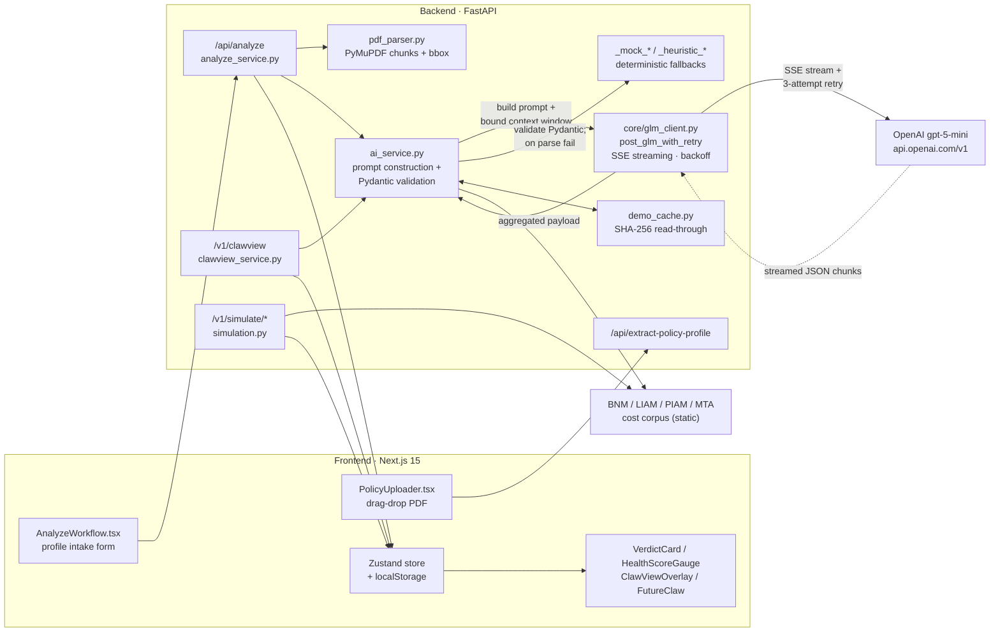
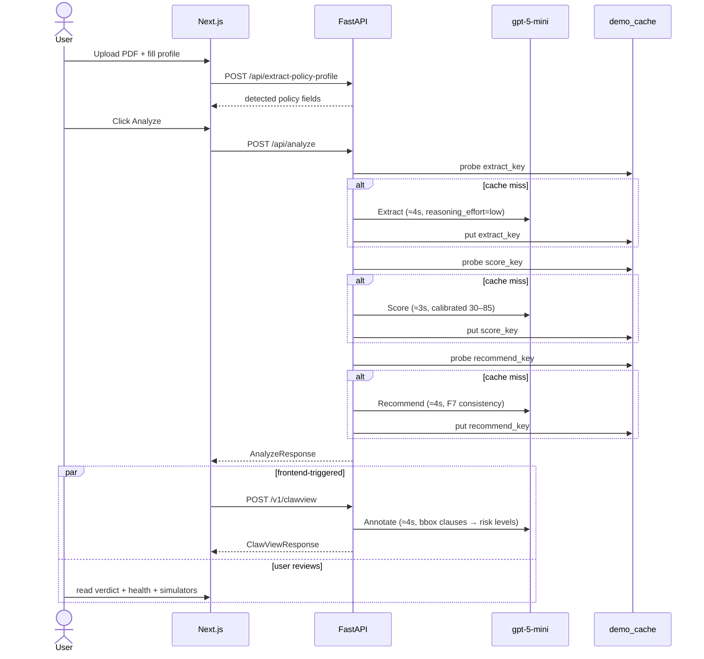
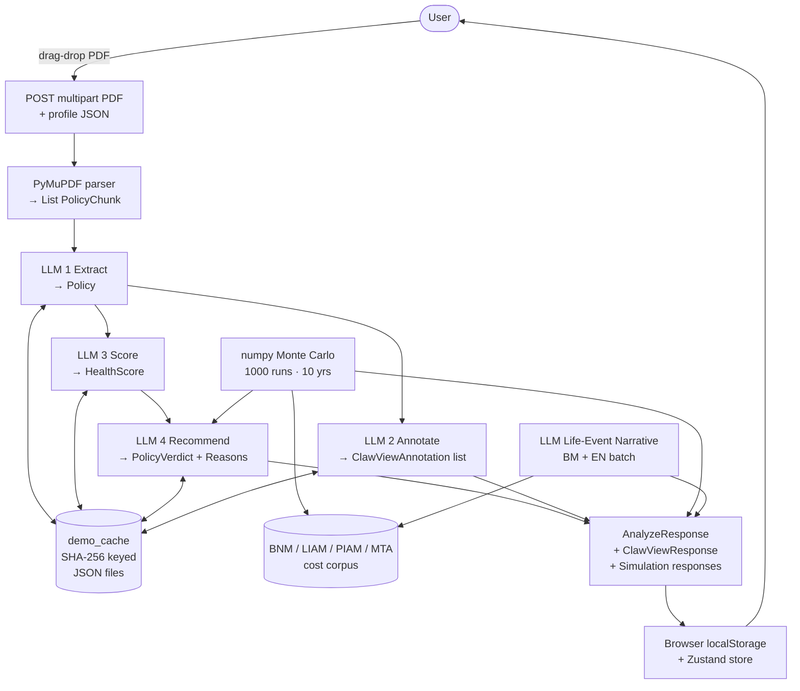
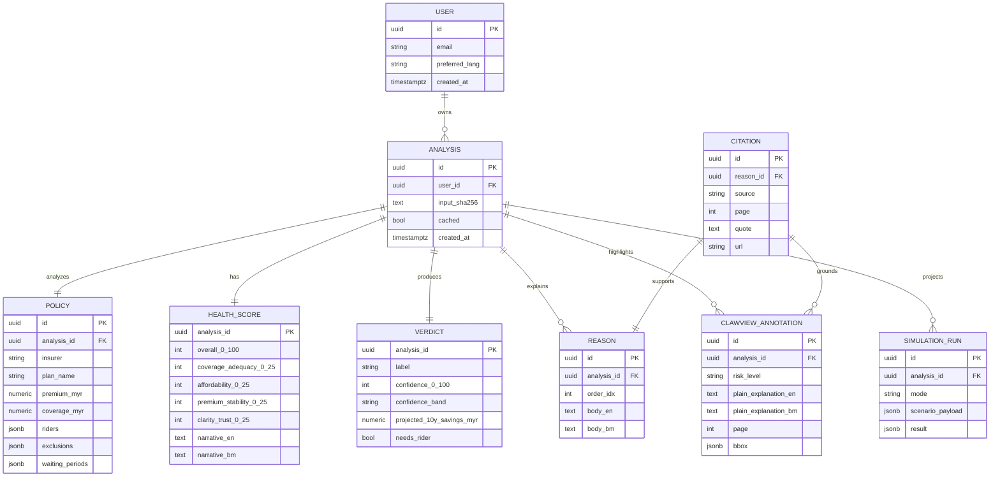

# PolicyClaw — System Analysis Documentation (SAD)

| | |
|---|---|
| **Project** | PolicyClaw — AI insurance decision copilot for Malaysians |
| **Event** | UMHackathon 2026 — Domain 2 (AI for Economic Empowerment & Decision Intelligence) |
| **Document version** | 1.0 — 2026-04-26 |
| **Status** | Active — Hackathon MVP submission |
| **Paired specs** | `PRD.md` v2.2, `QATD.md` v1.0 |
| **Tagline** | *Claw through complexity. Decide with confidence.* |

---

## 1. Introduction

PolicyClaw is an AI insurance decision copilot built for the 2024–2026 Malaysian repricing crisis. A user uploads 1–3 policy PDFs, confirms auto-detected profile fields, and receives a verdict — **Hold / Switch / Downgrade / Add Rider** — grounded in four sequential `gpt-5-mini` calls (Extract, Annotate, Score, Recommend), every output cited to a specific clause and page.

### 1.1 Purpose

This System Analysis Documentation describes the technical scope and design decisions behind PolicyClaw's 24-hour hackathon MVP. It is the engineering counterpart to the product spec (`PRD.md`) and the quality plan (`QATD.md`). Readers should treat the PRD as authoritative for *what* must ship and *why*; this document is authoritative for *how* it ships.

The key system elements covered:

1. **Architecture** — Two-tier web application (Next.js 15 frontend ↔ FastAPI backend) deployed on a single demo machine. The reasoning layer is a streaming OpenAI `gpt-5-mini` integration; persistence is ephemeral cache + browser `localStorage` (Supabase is the post-hackathon ship target).
2. **Data Flows** — How a PDF moves from the browser uploader through PyMuPDF parsing, four staged LLM calls (each cache-keyed by SHA-256), Monte Carlo simulation in numpy, and finally back to the browser as an `AnalyzeResponse` plus a deferred ClawView annotation payload.
3. **Model Process** — End-to-end LLM orchestration: prompt construction, context-window assembly from `PolicyChunk` lists, SSE-streamed responses, Pydantic validation, and a deterministic mock/heuristic fallback when the upstream model is unreachable.
4. **Role of Reference** — A single source of truth for the implementing developer, the QA reviewer, and the hackathon judge to align on architectural intent without reading the entire codebase.

### 1.2 Background

Malaysia's medical insurance market entered a repricing crisis in 2024: 9% of MHIT policyholders saw premium hikes greater than 40% (BNM 2024 Annual Report); cumulative claims inflation reached 56% across 2021–2023; and Bank Negara Malaysia's interim 10% annual cap window expires **31 December 2026**. Most policyholders do not know they qualify for the cap. Combined with the 30 million Malaysians EY estimated as underinsured in 2024, the root problem is decision paralysis, not affordability — there is no neutral, explainable second opinion in Bahasa Malaysia or English. PolicyClaw addresses that gap.

**Previous version.** None — this is the first build, scaffolded from scratch during UMHackathon 2026.

**Changes in major architectural components.** The reasoning provider was swapped during the build. The project initially targeted **Z.AI GLM via Ilmu (`api.ilmu.ai` / `ilmu-glm-5.1`)** to satisfy the hackathon's then-mandatory Z.AI rule. The Ilmu gateway proved unstable in practice; the organizers waived the Z.AI requirement for this submission, and the reasoning layer was re-pointed to **OpenAI `gpt-5-mini`** on `https://api.openai.com/v1`. The shared `glm_client.py` retains the `post_glm_with_retry` name (single-line transport contract) but routes to OpenAI; payload adaptation strips the `temperature` / `top_p` keys that `gpt-5-*` reasoning models reject and injects `reasoning_effort: "low"`.

**New capabilities introduced in this build.**

- **ClawView (Wow Factor 1)** — color-coded green/yellow/red risk highlights overlaid on the original PDF using PyMuPDF bounding boxes plus an LLM annotation pass.
- **FutureClaw (Wow Factor 2)** — an interactive 10-year Monte Carlo simulator with two toggleable modes (Affordability and Life Event), 1000-run numpy simulation, and an LLM narrative pass that runs once per scenario change rather than once per slider tick.
- **Demo-cache reliability layer** — every LLM stage is cache-keyed by SHA-256 of its canonical input so that identical reruns return byte-identical outputs, protecting both verdict consistency (PRD F7) and live-demo wifi drops.

### 1.3 Target Stakeholders

| Stakeholder | Role | Expectations |
|---|---|---|
| **Policyholder (primary user)** | Aisyah, 38, M40 KL marketing manager — 2–4 active policies, just received a repricing notice with 30 days to decide. | Plain-language verdict, citation on every claim, BM/EN toggle, downloadable Action Summary, no commission-driven nudges. |
| **Future advisor (secondary user)** | Licensed agent or family member assisting a policyholder. | Confidence-scored output that flags low-certainty cases for human follow-up; no auto-purchase or auto-cancel. |
| **Insurance regulator (judging proxy)** | BNM-style oversight perspective applied by hackathon judges. | "Decision support, not advice" disclaimer on every recommendation screen; PDPA-compatible privacy posture; no PII in logs. |
| **Development team (solo dev)** | Single developer building the 24-hour MVP. | Modular FastAPI services, typed Pydantic contracts, single LLM entry point (`glm_client.py`), deterministic fallbacks for offline iteration. |
| **QA reviewer** | The author of `QATD.md` validating risk + test posture. | Defined endpoint contracts, schema-validated responses, pytest coverage on extraction / simulation / verdict paths, CI gating on smoke import + frontend build. |
| **Hackathon judges** | UMHackathon 2026 panel (Domain 2). | Architecture aligned with the SAD template, evidence of LLM centrality, working ClawView + FutureClaw demos, defensible technology choices. |

---

## 2. System Architecture & Design

### 2.1 High Level Architecture

#### 2.1.1 Overview

| Type | Details |
|---|---|
| **System** | Web Application (responsive, desktop-first; tested down to iPhone 14 viewport) |
| **Architecture** | Two-tier client–server with a streaming AI service layer. Single-machine demo; no microservice split. |

PolicyClaw is structured as a client–server web application. There is one client surface — a Next.js 15 App Router single-page experience served from `localhost:3000` — and one backend — a FastAPI service on `localhost:8000`. The two communicate over JSON / multipart HTTPS. The backend wraps three internal subsystems: a PDF ingestion pipeline (PyMuPDF), a four-call LLM orchestrator (OpenAI `gpt-5-mini` via streaming SSE), and a pure-Python Monte Carlo simulator (numpy + scipy). Persistence in the MVP is **ephemeral**: process memory plus a SHA-256-keyed JSON cache under `backend/data/demo_cache/`. Browser state lives in React + Zustand + `localStorage`. Supabase (Postgres + pgvector + Auth + Storage + Realtime) is the post-hackathon ship target — explicitly **not MVP-gating** per PRD §8.2.

```
┌─────────────────────────────────────────────┐
│ User (Malaysian policyholder)               │
│ Uploads 1–3 PDFs, fills profile, reviews    │
└──────────────────┬──────────────────────────┘
                   │ HTTPS / multipart
                   ▼
┌─────────────────────────────────────────────┐
│ Next.js 15 — localhost:3000                 │
│ App Router · React 19 · TypeScript 5.8      │
│ Tailwind · Recharts · Zustand · Framer      │
│ Motion · react-pdf-viewer · jsPDF           │
└──────────────────┬──────────────────────────┘
                   │ fetch JSON
                   ▼
┌─────────────────────────────────────────────┐
│ FastAPI — localhost:8000                    │
│ /api/extract-policy-profile                 │
│ /api/analyze   (3-call backend pipeline)    │
│ /v1/clawview   (4th LLM call — Annotate)    │
│ /v1/simulate/affordability                  │
│ /v1/simulate/life-event                     │
└──┬──────────────────┬─────────────────────┬─┘
   │                  │                     │
   ▼                  ▼                     ▼
┌──────────┐ ┌────────────────────┐ ┌────────────────┐
│ PyMuPDF  │ │ OpenAI             │ │ numpy + scipy  │
│ parser   │ │ gpt-5-mini         │ │ Monte Carlo    │
│ (chunks  │ │ streamed via httpx │ │ (simulation)   │
│ + bbox)  │ │ + retry/fallback   │ │                │
└──────────┘ └────────────────────┘ └────────────────┘
                      │
                      ▼
              ┌──────────────────┐
              │ Local demo cache │
              │ backend/data/    │
              │ demo_cache/*.json│
              └──────────────────┘
```

#### 2.1.2 LLM as a Service Layer

The reasoning layer is **not** a generic "AI module" hung off the side of the architecture. `gpt-5-mini` plays four distinct roles in the request lifecycle, each with its own prompt, its own Pydantic response schema, and its own deterministic fallback. Removing the LLM removes plain-language extraction, ClawView clause annotations, Health Score sub-scores, and the recommendation narrative. Only the Monte Carlo numbers survive — and even those lose their interpretation. This is the LLM-centrality test the hackathon brief enforces.

| LLM call | Endpoint that fires it | Input | Output | Failure mode |
|---|---|---|---|---|
| **1. Extract** | `POST /api/analyze` (stage 1) | Raw PDF text + user profile | Structured `Policy` Pydantic model — insurer, premium, coverage, riders, exclusions, waiting periods | `_mock_policy_xray` returns LOW-confidence canned shape |
| **2. Annotate** | `POST /v1/clawview` (frontend-triggered after Analyze returns) | Bounding-boxed clauses | List of `ClawViewAnnotation` with `risk_level ∈ {green, yellow, red}` + plain explanation + clause id | Heuristic risk classifier seeded by keyword rules |
| **3. Score** | `POST /api/analyze` (stage 2) | Extracted policy + profile | `HealthScore` with 4 sub-scores (Coverage Adequacy, Affordability, Premium Stability, Clarity & Trust) | `_heuristic_health_score` calibrated to land in the 30–85 band per PRD F5 |
| **4. Recommend** | `POST /api/analyze` (stage 3) | Extracted policy + score + 10-year projected cost | Verdict + 3 cited Reasons + confidence band + MYR impact + `needs_rider` flag | Deterministic `generate_verdict` heuristic with LOW confidence band |

A separate single-batch LLM call powers FutureClaw life-event narratives (`futureclaw_narrative.py`) — bilingual (BM + EN) one-shot generation of the four scenario narratives, fired only on user mode toggle, not on slider drag. This is intentionally *outside* the four-call pipeline because it is interactive and triggered by the user, not by analysis.

**Token / context limits and chunking.** PyMuPDF chunks each PDF into `PolicyChunk` objects with page + section + bbox. The Extract call sees the full chunk list (typical demo policy: ~40 chunks, ~12k tokens). For longer policies, `rag.py` performs lexical retrieval to keep the context window under the model's effective limit. The Annotate call is per-chunk-batch and is tightened to **2 attempts / 30s** (vs. the default 3 attempts / 120s) so a slow upstream response degrades to the heuristic mock within ~60s instead of stalling the frontend.

**Demo cache as part of the LLM contract.** Each of Extract, Score, Recommend, and Annotate is read-through to `backend/data/demo_cache/<stage>_<sha256>.json` — identical inputs produce identical outputs across fresh processes. This is what gives PRD F7 verdict consistency without relying on `temperature` (which the `gpt-5-*` reasoning model rejects).

#### 2.1.3 Dependency Diagram

How prompts are constructed, sent, parsed, and routed back through the system. Distributed components are not in scope (single-machine demo); the diagram emphasizes the AI service layer.



**Reading guide.** The user uploads via `PolicyUploader.tsx`, which calls `/api/extract-policy-profile` to auto-fill the intake form. On *Analyze*, `/api/analyze` orchestrates the three sequential LLM calls; each call funnels through `ai_service.py` for prompt construction, then through `glm_client.post_glm_with_retry` for streaming transport, then back through `ai_service` for Pydantic validation. The cache layer wraps every stage. ClawView (`/v1/clawview`) is fired separately by the frontend in parallel with the user reviewing the verdict — the fourth LLM call does not block perceived end-to-end latency. The Monte Carlo simulator never invokes the LLM during a slider drag; it only triggers a narrative regeneration on mode toggle.

#### 2.1.4 Sequence Diagram — Analyze Flow

Walks through the `Aisyah uploads a medical policy` user journey from intake to verdict. Demonstrates the 3+1 LLM call orchestration and the parallel ClawView fetch.



### 2.2 Technological Stack

| Layer | Choice | Rationale |
|---|---|---|
| **Frontend** | Next.js 15 (App Router), React 19, TypeScript 5.8, Tailwind, shadcn/ui, react-pdf-viewer, Recharts, Zustand, TanStack Query, Framer Motion, jsPDF | App Router gives us route-level code splitting; react-pdf-viewer renders the policy PDF inline so the ClawView SVG overlay can be portaled into it; Recharts handles the FutureClaw line + bar charts; Zustand keeps the BM/EN language toggle coherent without reducer boilerplate; jsPDF generates the one-page Action Summary client-side in <2s with no backend round-trip. |
| **Backend** | Python 3.12, FastAPI, Pydantic v2, httpx (streaming), numpy, scipy, PyMuPDF (fitz) | Typed async endpoints with auto-generated OpenAPI at `/docs`; Pydantic v2 models double as the LLM response contracts; PyMuPDF returns per-clause bounding-box coordinates that ClawView's SVG overlay needs — pypdf does not. |
| **AI** | OpenAI `gpt-5-mini` on `https://api.openai.com/v1` via streaming SSE through `core/glm_client.py:post_glm_with_retry`. 3 attempts × 120s read timeout default; Annotate tightened to 2 × 30s. | Streaming SSE keeps long reasoning-model responses healthy. Reasoning models reject `temperature` / `top_p` — the shared client strips them and injects `reasoning_effort: "low"` automatically (see `_adapt_payload_for_provider` in `glm_client.py`). |
| **Database (MVP)** | None — process memory + browser `localStorage` + SHA-256-keyed JSON cache under `backend/data/demo_cache/` | A 24-hour build cannot afford schema-migration risk. The cache layer guarantees both verdict consistency and offline-safe demos. |
| **Database (ship target)** | Supabase: managed Postgres + pgvector + Auth (magic-link) + Storage (private bucket with signed URLs) + Realtime + Row Level Security | Unlocks RAG over the BNM / LIAM / PIAM / MTA corpus, PDPA-compatible deletion endpoint, and live-stream agent results during a future demo. Explicitly **not MVP-gating** per PRD §8.2. |
| **Cloud / Deployment** | Local development on the demo laptop. CI on GitHub Actions (`ubuntu-latest`, Python 3.12 + Node 20). | Frontend deployment (Vercel) and backend deployment (Render / Fly) are post-hackathon. Localhost demo eliminates network-fault surface during judging. |

### 2.3 Key Data Flows

#### 2.3.1 Data Flow Diagram (DFD)

How data moves across the system and how it is structured at each hop.



**Black-hole / sink check.** Every store has both an in- and out-edge. `demo_cache` is bi-directional (read on probe, write on miss). `localStorage` reads on session resume, writes on each step. The static corpus is read-only by design (curated pre-hackathon).

**No-PII guarantee.** Logs use UUID `analysis_id` only. Uploaded PDFs are held in process memory only for the lifetime of the analysis call, then dropped. The PDPA-compatible deletion endpoint is part of the Supabase ship target, not the MVP.

#### 2.3.2 Normalized Database Schema (ERD)

The MVP has no database — frontend state + backend cache only. The ERD below describes the **post-hackathon ship target** in 3NF, against which the in-memory contracts already align so the migration is mechanical when Supabase is enabled.



**3NF notes.** `REASON` is a junction-style child of `ANALYSIS` rather than nesting in `VERDICT`, so reasons can be reordered or paginated independently. `CITATION` is referenced rather than embedded — the same clause can ground both a Reason in the verdict and a ClawView annotation, eliminating duplication. `SIMULATION_RUN.result` is JSONB rather than a wide column set because the affordability and life-event modes have different shapes (sliders vs. scenario picker); promoting to typed tables is post-MVP. Static cost data (BNM / LIAM / PIAM / MTA) is intentionally **not** modeled here — it lives as version-pinned JSON in `backend/data/bnm_corpus/` per PRD P5 (Malaysian-first, real cited data).

---

## 3. Functional Requirements & Scope

### 3.1 Minimum Viable Product

The 24-hour build commits to five demonstrable features, each mapped to a PRD F-number for traceability. Every feature is P0 (ship-or-die) except multilingual which is P1.

| # | Feature | Description |
|---|---|---|
| 1 | **ClawView (Wow Factor 1, F4)** | Color-coded green / yellow / red risk highlights overlaid on the original PDF using PyMuPDF bounding boxes plus the LLM Annotate call. Click a highlight → tooltip with plain-language explanation + citation. Acceptance: ≥8 highlights per demo policy, color coding accurate (red ≠ random), no offset bugs. |
| 2 | **FutureClaw (Wow Factor 2, F6)** | Interactive 10-year Monte Carlo simulator with two toggleable modes. *Affordability* — premium vs. income trajectory under inflation sliders, flags year premium > 10% of income. *Life Event* — Cancer / Heart Attack / Disability / Death scenarios with covered / co-pay / out-of-pocket bars and bilingual narrative. 1000 numpy runs, no LLM in the slider loop. |
| 3 | **Policy Health Score (F5)** | 0–100 gauge with four 0–25 sub-scores (Coverage Adequacy, Affordability, Premium Stability, Clarity & Trust). Calibrated to land sample policies in the 30–85 band — not all 90+ — so the score has signal. |
| 4 | **Verdict + Citations (F7)** | One of *HOLD / DOWNGRADE / SWITCH / ADD RIDER* with three cited reasons, a 0–100% confidence score, projected 10-year MYR impact, and a "Not financial advice" disclaimer. Verdict is byte-identical across three reruns of the same input (cache-enforced determinism). |
| 5 | **Action Summary download (F8)** | Client-side jsPDF generation of a one-page summary (verdict, top 3 reasons, top 3 actions, disclaimer, `analysis_id`) in <2s with no backend round-trip. |

Multilingual support (F9 — BM + EN, JSON-dict i18n, no `i18next`) is P1 but already shipped: backend strings are returned in both languages (`narrative_en`, `narrative_bm`); frontend toggles via a 40-line `t(key, lang)` helper. Polish (F10 — Framer Motion transitions) is P0 and shipped on key screens.

### 3.2 Non-Functional Requirements

| Quality | Requirement | Implementation |
|---|---|---|
| **Scalability** | Single-machine demo handles a sustained sequence of analyses with one concurrent user (the demo presenter). Out-of-scope: multi-tenant load — the post-hackathon Supabase target adds RLS + connection pooling for that. | FastAPI uvicorn worker; numpy simulation runs in <50 ms; LLM is the bottleneck (≈15 s per cold analysis, instant on warm cache). |
| **Reliability** | `/api/analyze` must return a non-error response under every failure mode the LLM can produce — including unreachable, malformed JSON, schema-validation failures, and missing API key. ClawView (`/v1/clawview`) must degrade gracefully without blanking the page. | Each LLM stage has a deterministic fallback (`_mock_*` / `_heuristic_*`). The pipeline never returns 500 from an LLM problem. ClawView is wrapped in a class `ErrorBoundary`. Per PRD §9.2: 3 attempts / 120s read timeout default; Annotate tightens to 2 / 30s. |
| **Maintainability** | Single LLM entry point; schemas split by domain; endpoint handlers separate from services. Adding a fifth LLM call should require touching one service file and one schema file. | `core/glm_client.py` is the only place that talks HTTP to the model. `app/api/` holds handlers; `app/services/` holds orchestration; `app/schemas/` holds Pydantic contracts split into `common`, `policy`, `analyze`, `clawview`, `futureclaw`, `legacy_ai` packages. |
| **Token / Latency** | `/api/analyze` ≤ 15 s end-to-end (4 LLM calls, ~14 s LLM time + ~1 s overhead). ClawView ≤ 30 s worst case before degrading to mock. Slider drag stays at 60 FPS. | Streaming SSE on every LLM call; demo cache makes warm reruns instant; numpy keeps the LLM out of the slider loop; 5 s timeout buffer on async fetches with user-facing loading state. |
| **Cost Efficiency** | Average per-session token budget bounded; repeat queries on the same input never re-bill. | SHA-256 read-through demo cache de-duplicates identical reruns. Prompts are length-capped via `rag.py` lexical retrieval before the Extract call. The four-call pipeline is the upper bound; FutureClaw narrative regenerates only on mode toggle, never on slider drag. |
| **Accessibility** | WCAG 2.1 AA target. | Color-blind-safe risk palette (red ≠ green-only signal — shape + label too); keyboard navigation; ARIA labels. |
| **Privacy** | No PII in logs. PDFs not persisted in MVP. | UUID `analysis_id` only in logs; PDF bytes held in process memory for the analysis call lifetime, then dropped. PDPA-compatible deletion endpoint is part of the Supabase ship target. |

### 3.3 Out of Scope / Future Enhancements

Scoped out of UMHackathon 2026 submission, kept on the post-hackathon backlog:

a. **Real-time insurer API integration** — no public Malaysian insurer offers one.
b. **Actual policy purchase / cancellation** — regulated activity outside the decision-support remit (P3 anti-principle).
c. **Claims filing assistance** — separate workflow, separate user journey.
d. **SME / business insurance** — different policy structures, different cost data.
e. **Native mobile applications** — responsive web only for MVP.
f. **Voice interface** — too risky to ship in 24 hours; scaffold endpoint stays in mock mode.
g. **Mandarin / Tamil / Hokkien support** — BM + EN only per PRD P5.
h. **Takaful Shariah-deep features** — current MVP is generic-takaful-aware but not Shariah-board-validated.
i. **OCR for scanned PDFs** — PyMuPDF text-native only; Tesseract integration deferred.
j. **Production frontend deployment** — localhost demo for the hackathon; Vercel + Render are the post-hackathon targets.
k. **Supabase persistence layer** — Auth, RLS, pgvector RAG, Realtime streaming, PDPA deletion endpoint — all flagged in PRD §8.2 / §9.3 as ship target, not MVP-gating.

---

## 4. Monitor, Evaluation, Assumptions & Dependencies

### 4.1 Technical Evaluation

#### 4.1.1 Grayscale Rollout & A/B Testing

The hackathon submission is a single-machine demo with one user — there is no production rollout to grayscale against. The closest analogue is the `/v1/ai/status` endpoint, which exposes whether the backend is in **mock** or **live** mode; the frontend toggles a small badge based on that flag. This gives the same observability surface a real grayscale would.

Post-hackathon plan: when the Supabase + Vercel deployment lands, a new feature (e.g. an OCR ingestion path for scanned PDFs) will roll out behind a feature flag to 5% of authenticated users, monitor error rate and verdict-consistency drift for 24 hours, and graduate to 100% if the metrics hold. A/B testing two prompt variants for the Recommend stage is a natural first experiment because verdict consistency is already instrumented (see PRD F7 / `test_verdict_consistency.py`).

#### 4.1.2 Emergency Rollback & Golden Release

PolicyClaw's Golden Release strategy is **multi-layer fallback**, not a CI/CD redeploy primitive. Every LLM stage is wrapped in three layers:

1. **Demo cache (Golden)** — `backend/data/demo_cache/<stage>_<sha256>.json` is pre-warmed for the three sample policies before the demo. A wifi outage or upstream API failure surfaces the cached payload with a "Served from demo cache" badge in the UI. This is the equivalent of automatic redeploy-to-Golden in a server context.
2. **Heuristic fallback (Emergency Rollback)** — when the cache misses *and* the LLM is unreachable / returns malformed JSON / fails Pydantic validation, the pipeline routes into `_mock_*` / `_heuristic_*` deterministic functions. Confidence band drops to LOW, the UI nudges the user toward a human advisor (P4 calibrated confidence).
3. **Schema validation guard (last line)** — `_extract_json_from_content` tolerates code-fenced LLM responses; on validation failure, the wrapper catches and routes into the heuristic path rather than 500-ing.

CI/CD-side: GitHub Actions runs a smoke-import + pytest hard-gate on every push (see §4.2). A failed gate blocks merge; rollback is `git revert` on the offending commit since the demo deploys directly from `main`.

#### 4.1.3 Priority Matrix

Defines what triggers each emergency response and what the system does.

| Priority | Trigger condition | Action | Owner |
|---|---|---|---|
| **P1 — Critical** | LLM upstream returns 5xx or times out (>120 s default; >30 s on Annotate). | `post_glm_with_retry` exhausts attempts, raises; calling stage catches and routes to heuristic fallback with LOW confidence band. UI shows "Limited annotation available" or equivalent. Demo continues. | shell |
| **P1 — Critical** | `OPENAI_API_KEY` absent in `backend/.env`. | Pipeline detects missing key at startup and enters mock / heuristic mode for all four LLM calls. `/v1/ai/status` reports `mode: mock`. Demo continues end-to-end with cached + heuristic outputs. | shell |
| **P2 — High** | PyMuPDF fails to extract text (scanned-only PDF with no text layer). | `parse_pdf_chunks` returns `[]`; `clawview_service` surfaces a low-confidence "limited annotation" response rather than a 500. UI shows an inline message; rest of flow continues. | clawview |
| **P2 — High** | Verdict drift across reruns (F7 break). | Demo cache write-through enforces byte-identical reruns. `test_verdict_consistency.py` is a CI hard-gate when present; a failure blocks merge. | shell |
| **P3 — Medium** | Frontend chart export fails on a niche browser. | Action Summary PDF still works (jsPDF is the demo path); chart PNG export is a polish feature, surfaces a toast on failure. | futureclaw |
| **P3 — Medium** | Style debt (`ruff`, `npm run lint`) regressions. | Lint is informational in CI (`continue-on-error: true`); merges proceed. Promote to hard gate post-hackathon. | shell |

### 4.2 Monitoring

The MVP is single-machine and demo-time, so monitoring is minimal but explicit:

- **CI gate.** `.github/workflows/ci.yml` runs on every push and PR. Backend job: `pip install -r backend/requirements.txt` → smoke import `python -c "import app.main"` (hard gate) → `ruff check backend/` (informational) → `pytest backend/tests/ -q` (hard gate when tests present). Frontend job: `npm ci --prefix frontend` → `npm run lint --prefix frontend` (informational) → `npm run build --prefix frontend` (hard gate). 19 backend pytests are currently green.
- **Live status endpoint.** `GET /v1/ai/status` returns the live-vs-mock state and the configured model id. The frontend reads this once on session start and shows a badge if mock mode is active — judges see the truth at a glance.
- **Frontend error boundary.** `components/ErrorBoundary.tsx` wraps the ClawView and FutureClaw subtrees. A runtime exception in either feature surfaces a friendly inline message instead of blanking the page.
- **Demo cache observability.** Cache hits set `cached: true` on `AnalyzeResponse`; the frontend shows a "Served from demo cache" badge so the demo presenter knows the path being exercised.

Post-hackathon plan: Supabase Realtime + a lightweight health dashboard (Sentry / Logtail) cover error rate, p95 latency, and verdict-consistency drift.

### 4.3 Assumptions

State the operational and environmental conditions that must hold for the MVP to function as specified.

- **Text-native PDFs.** Sample policies are exported from insurer portals with a real text layer. Scanned-only PDFs are an explicit P2 fallback (limited annotation), not a primary path.
- **Stable internet for the live demo.** The demo cache is the contingency: if wifi drops, pre-warmed cached payloads serve every stage. The presenter can disable wifi pre-demo and the flow still works.
- **`OPENAI_API_KEY` available in `backend/.env`.** When unset, the pipeline enters mock / heuristic mode automatically — useful for offline iteration; the live-LLM path is the demo path.
- **Single concurrent user.** The demo presenter. Multi-user concurrency is post-hackathon.
- **Modern browser (Chrome 120+, Safari 17+, Firefox 121+, Edge 120+).** react-pdf-viewer + SVG overlay assume current browser engines; the experience is degraded on older browsers.
- **Malaysian context.** Cost data comes from BNM / LIAM / PIAM / MTA; outputs assume MYR. Non-Malaysian policies fall outside the demo scope.
- **English-or-Bahasa-Malaysia user.** Other Malaysian languages are out of scope per PRD P5.

### 4.4 External Dependencies

External tools and data sources the system relies on, each with a risk and a mitigation.

| Tool / data | Purpose | Risk | Mitigation |
|---|---|---|---|
| **OpenAI `gpt-5-mini` API** | The four-role reasoning engine — Extract / Annotate / Score / Recommend, plus FutureClaw life-event narratives. | High — rate limits or upstream outages would gut every AI claim. | Streaming `post_glm_with_retry` with exponential-backoff retries. Demo cache pre-warmed for sample policies. Every stage has a deterministic mock / heuristic fallback. ClawView Annotate tightens to 2 / 30s so a slow upstream degrades within ~60s. |
| **PyMuPDF (fitz) 1.26+** | Text extraction with per-clause bounding boxes — required for the ClawView SVG overlay. | Medium — pip install can fail on uncommon platforms; no bbox = no ClawView wow factor. | Pinned in `requirements.txt`. `pdf_parser.parse_pdf_chunks` returns `[]` on garbage bytes; ClawView falls back to a side-pane risk list per PRD §10 critical-cut points. |
| **BNM / LIAM / PIAM / MTA cost corpus** | Real Malaysian medical-inflation series + life-event cost medians for FutureClaw. | Low — static JSON shipped under `backend/data/bnm_corpus/`, version-pinned. | Curated pre-hackathon; checksummed at load; cited with source URL on each scenario card. |
| **react-pdf-viewer + jsPDF** | Inline PDF rendering and client-side Action Summary export. | Low — both are stable npm packages with permissive licenses. | Pinned versions; jsPDF synchronous render path keeps Action Summary <2 s with no backend dependency. |
| **GitHub Actions** | CI gate on every push. | Low — outages affect velocity but not the demo. | Local-machine fallback: `pytest backend/tests/ -q` + `npm run build --prefix frontend` reproduce the gate. |

---

## 5. Project Management & Team Contributions

### 5.1 Project Timeline

The build window is 24 hours; the timeline maps to PRD §10. Each phase has a checkpoint.

| Hours | Phase | Deliverables |
|---|---|---|
| **0–2** | Foundations | Next.js + FastAPI scaffolds running. LLM client smoke-tested. Three sample PDFs anonymized. Supabase setup attempted; deferred if it took >30 min — fell back to in-memory + cache as PRD §8.2 sanctions. |
| **2–6** | Backend core | `/upload` + PyMuPDF text extraction with bounding boxes. **LLM Call 1 (Extract)** working through streaming `post_glm_with_retry` + Pydantic validation. Schemas defined; BNM corpus seeded. |
| **6–10** | ClawView (Wow 1) | **LLM Call 2 (Annotate)** returns per-clause risk levels. react-pdf-viewer + SVG bounding-box overlay shipped. Click-to-tooltip working. *Checkpoint: ClawView visibly working on one policy.* |
| **10–14** | Health Score + Recommendation | **LLM Call 3 (Score)** → four sub-scores → circular gauge. **LLM Call 4 (Recommend)** → verdict + reasons + confidence → VerdictCard. |
| **14–18** | FutureClaw (Wow 2) | numpy Monte Carlo working. Affordability chart + sliders. Life Event mode with four scenarios (Cancer / Heart Attack / Disability / Death). LLM narrative pass. *Checkpoint: both wow factors demonstrable.* |
| **18–21** | Polish | Action Summary jsPDF download. BM/EN toggle. Framer Motion transitions, loading states, error boundaries. |
| **21–23** | Testing & docs | 19 pytest units green (extraction, simulation, FutureClaw, verdict consistency). README + architecture section. PRD / SAD / QATD final pass. |
| **23–24** | Demo prep | Three full demo run-throughs. Four-minute screen capture as backup. Demo cache pre-warmed for the three sample PDFs. |

**Critical cut points.** If at Hour 12 the core flow isn't end-to-end working: cut F9 (EN only), cut Life Event mode (Affordability only), cut PDF download (screen-only summary). If at Hour 18 ClawView isn't aligned: fall back to a side-pane risk list with page references — loses the *wow* but ships.

### 5.2 Team Members & Roles

| Member | Role | Responsibilities |
|---|---|---|
| **Solo developer** | Full-stack engineer | Backend FastAPI services, frontend Next.js components, LLM prompt engineering, Monte Carlo simulation, CI configuration, the SAD / PRD / QATD documentation set. |
| **Claude Code (paired AI)** | Pair-programming assistant | Schema scaffolding, refactoring passes, test authoring, documentation drafting. Reviewed by the human developer before commit. |

This is a solo-dev hackathon entry per `CLAUDE.md`'s framing; there is no team to split roles across. The role row is included to align with the SAD template — readers should treat all of "Backend Lead", "Frontend Lead", "QA Lead", "DevOps", "Tech Writer", and "Product Owner" as collapsed onto the solo developer.

### 5.3 Recommendations

Forward-looking improvements after the hackathon submission, ordered by expected impact.

1. **Wire Supabase as the persistence + auth layer.** Per PRD §8.2 the Supabase target unlocks pgvector RAG (real semantic retrieval over the BNM corpus instead of `rag.py`'s lexical baseline), magic-link Auth, RLS-enforced PDPA deletion, and Realtime streaming so multi-stage agents can broadcast progress to a future demo. Setup is ~15–20 minutes once outside the 24-hour window.
2. **Promote `ruff` and `npm run lint` to hard CI gates.** Currently informational so style debt cannot block the 24-hour critical path. Once stable, these should fail the build.
3. **Real OCR ingestion for scanned PDFs.** Tesseract or a hosted equivalent expands the addressable user base — a meaningful share of Malaysian policies still arrive as image-only PDFs.
4. **Embedding-based retrieval in `rag.py`.** Replace the lexical scorer with `text-embedding-3-small` (or Supabase pgvector) once the corpus grows beyond what fits comfortably in context.
5. **Frontend Vitest + Playwright suite.** The 24-hour budget excluded both; manual QA + the CI build gate carry the frontend today. Add unit tests for the `t()` helper and the BM/EN toggle, plus a Playwright golden-path E2E.
6. **Redis or Vercel KV for the cache layer.** The on-disk SHA-256 cache is fine for one-machine demo; multi-instance deployments need a shared cache to keep verdict consistency across replicas.
7. **Real BM-fluent localization review.** The current BM strings come from the LLM; a native-speaker copy edit will sharpen them before any public release.

---

**End of SAD.** Paired with `PRD.md` v2.2 (product spec) and `QATD.md` v1.0 (risk + test plan). Decision-support software, not licensed financial advice.
