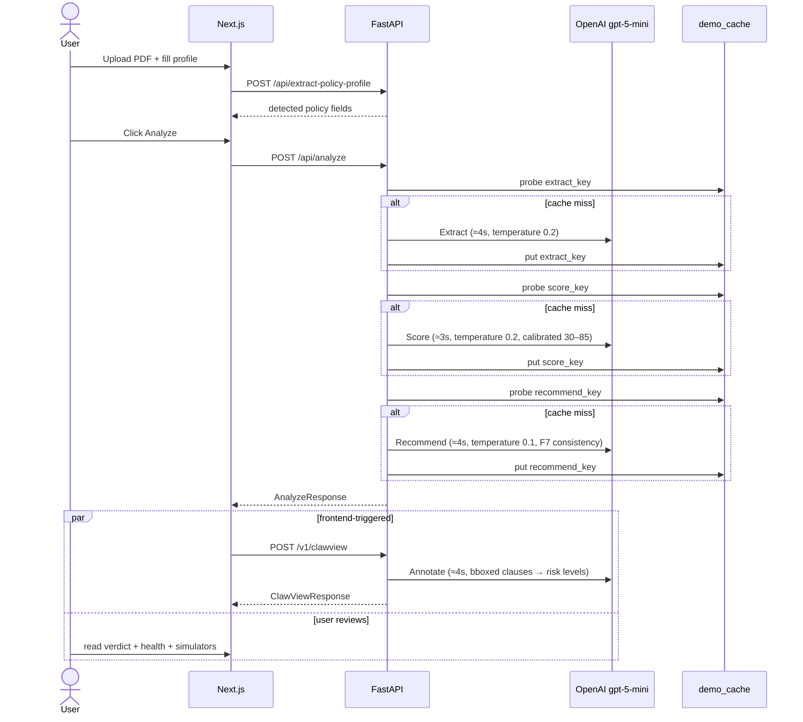

# PolicyClaw — System Architecture Document (SAD)

| | |
|---|---|
| **Version** | 1.0 — 2026-04-24 |
| **Status** | Active — Hackathon MVP |
| **Event** | UMHackathon 2026 — Domain 2 (AI for Economic Empowerment & Decision Intelligence) |
| **Authoritative spec** | `PRD.md` v2.2 |
| **Paired document** | `QATD.md` (testing, risks, CI) |

This document is judged against ~20% of the total rubric (System Logic 7%, System Schema 6%, Technical Feasibility 7% — all partly scored from this document, not only from running code). Reading order: PRD establishes *what* must ship and *why*; this document establishes *how* it ships.

---

## 1. System Overview

PolicyClaw is an AI insurance decision copilot for Malaysian policyholders. A user uploads 1–3 insurance PDFs, confirms auto-detected profile fields, and receives a verdict (**Hold / Switch / Downgrade / Add Rider**) grounded in four GLM calls: Extract, Annotate, Score, and Recommend. The two wow-factor demos — **ClawView** (color-coded risk highlights on the actual PDF) and **FutureClaw** (10-year Monte Carlo simulator with Affordability and Life Event modes) — are the judged differentiators.

```
┌─────────────────────────────────────────────┐
│ User (Malaysian policyholder)               │
│ Uploads 1–3 PDFs, fills profile, reviews    │
└──────────────────┬──────────────────────────┘
                   │ HTTPS / multipart
                   ▼
┌─────────────────────────────────────────────┐
│ Next.js 15 — localhost:3000                 │
│ App Router, React 19, TypeScript 5.8        │
│ Tailwind · Recharts · Zustand · Framer      │
│ Motion · react-pdf-viewer · jsPDF           │
└──────────────────┬──────────────────────────┘
                   │ fetch JSON
                   ▼
┌─────────────────────────────────────────────┐
│ FastAPI — localhost:8000                    │
│ /api/extract-policy-profile                 │
│ /api/analyze  (3-call backend pipeline)     │
│ /v1/clawview  (4th LLM call — Annotate)     │
│ /v1/simulate/affordability                  │
│ /v1/simulate/life-event                     │
└──┬──────────────────┬─────────────────────┬─┘
   │                  │                     │
   ▼                  ▼                     ▼
┌──────────┐ ┌────────────────────┐ ┌────────────────┐
│ PyMuPDF  │ │ OpenAI             │ │ numpy + scipy  │
│ parser   │ │ gpt-5-mini         │ │ Monte Carlo    │
│ (chunks  │ │ streamed via httpx │ │ (simulation)   │
│ + bbox)  │ │ + retry/fallback   │ │                │
└──────────┘ └────────────────────┘ └────────────────┘
                      │
                      ▼
              ┌──────────────────┐
              │ Local demo cache │
              │ backend/data/    │
              │ demo_cache/*.json│
              └──────────────────┘
```

**MVP persistence.** No database in the demo path. Frontend state is in React + Zustand + `localStorage`; backend state is ephemeral process memory plus the SHA-256-keyed on-disk cache under `backend/data/demo_cache/`. Supabase (Auth + Postgres + pgvector + Realtime) is the ship target post-hackathon (PRD §8.2) and is **not MVP-gating**.

---

## 2. Architecture Principles

Lifted directly from PRD §3:

- **P1. User-aligned** — no commissions from insurers.
- **P2. Explain or don't say it** — every AI claim cites a source clause + page.
- **P3. Decision support, not advice** — user decides; disclaimer on every recommendation screen.
- **P4. Confidence calibrated** — 0–100% on every output; low confidence suggests a human advisor.
- **P5. Malaysian-first** — BM + EN only for MVP; real BNM / LIAM / PIAM / MTA data.

**Anti-principles.** No selling user data. No auto-purchase or auto-cancel. No binding legal advice. No dark patterns.

---

## 3. Component Breakdown

### Backend services (`backend/app/services/`)

| Module | Purpose | Key inputs | Key outputs |
|---|---|---|---|
| `analyze_service.py` | 3-stage orchestrator for `/api/analyze` | uploaded PDF bytes + user profile | `AnalyzeResponse` |
| `ai_service.py` | All LLM calls + mock-mode fallbacks. Hosts `analyze_policy_xray` (Extract), `analyze_health_score` (Score), `analyze_policy_verdict` (Recommend). Handles demo-cache read/write. | `PolicyInput`, `PolicyXRayResponse`, `HealthScore` | `PolicyXRayResponse`, `HealthScore`, `PolicyVerdict` |
| `clawview_service.py` | LLM Call 2 (Annotate). Driven by `/v1/clawview`. PyMuPDF bbox clauses → `ClawViewAnnotation`s with risk_level + plain explanation. | raw PDF bytes | `ClawViewResponse` |
| `futureclaw_narrative.py` | Bilingual narrative batch for life-event scenarios. Single LLM call produces BM + EN strings per event. | 4 life-event scenarios + `PolicyInput` | narrative pairs |
| `simulation.py` | Pure-Python Monte Carlo. `project_premiums` (3 inflation scenarios over 10 years), `monte_carlo_affordability` (1000 runs), `simulate_life_events` (cancer / heart / disability / death). | `PolicyInput` + slider state | scenario arrays + cost breakdowns |
| `pdf_parser.py` | PyMuPDF text chunker. Text-native PDFs yield `PolicyChunk` lists with page + section; bbox-aware variant lives in `clawview_service`. | PDF bytes | `list[PolicyChunk]` |
| `rag.py` | Lexical retrieval + context builder. Swappable with embeddings post-hackathon. | chunks + query | ranked context string |
| `verdict.py` | Deterministic heuristic fallback (`generate_verdict`) used when the LLM is unreachable. | `PolicyInput`, 10-year cost | `(VerdictLabel, confidence, savings, band)` |
| `profile_extraction_service.py` | Drives `/api/extract-policy-profile` — auto-fills the intake form. | uploaded PDF | `ExtractPolicyProfileResponse` |
| `demo_cache.py` | SHA-256-keyed JSON read-through cache under `backend/data/demo_cache/`. Protects the demo against wifi drops (PRD §8.2). | stage name + canonical args | cached payload or `None` |

### Frontend (`frontend/app/analyze/`)

| Path | Responsibility |
|---|---|
| `AnalyzeWorkflow.tsx` | Master composer. Owns upload, profile intake, the `/api/analyze` call, the follow-up `postClawView` call, and the results layout. |
| `page.tsx` | Route entry. |
| `lib/types.ts` | TypeScript mirror of extended `AnalyzeResponse`; re-exports ClawView types from `frontend/lib/api.ts`. |
| `lib/store.ts` | Zustand store (language toggle). |
| `lib/i18n.ts` | BM/EN JSON dictionary + `t(key, lang)` helper (no `i18next`, per PRD F9). |
| `components/HealthScoreGauge.tsx` | Circular 0-100 gauge + 4 sub-score bars + bilingual narrative. |
| `components/VerdictCard.tsx` | Color pill (HOLD / DOWNGRADE / SWITCH / ADD RIDER) + 3 structured reasons with citations + confidence + 10-year MYR impact + disclaimer. |
| `components/ActionSummary.tsx` | jsPDF client-side one-page download (<2s, PRD F8). |
| `components/LanguageToggle.tsx` | BM ↔ EN pill toggle. |
| `components/ErrorBoundary.tsx` | Class error boundary wrapping ClawView + FutureClaw so a runtime failure doesn't blank the page. |
| `components/PdfViewer.tsx`, `ClawViewOverlay.tsx` | ClawView wow factor. `PdfViewer` renders each page and portals `ClawViewOverlay` with bbox-positioned SVG highlights. |
| `components/FutureClawSimulator.tsx`, `AffordabilitySimulator.tsx`, `LifeEventSimulator.tsx` | FutureClaw wow factor. `FutureClawSimulator` toggles between the two modes. |
| `components/PolicyUploader.tsx`, `chartExport.ts` | Drag-drop and chart PNG export helpers. |
| `frontend/lib/api.ts` | Typed fetch client for `/v1/clawview`. |

---

## 4. Data Flow — 3+1 LLM pipeline

`/api/analyze` runs the first three LLM calls sequentially (Extract → Score → Recommend). The fourth LLM call (Annotate for ClawView) is served by `/v1/clawview` and fired by the frontend in parallel with user review of the verdict + health gauge. Total 4 LLM calls per analysis; perceived end-to-end latency stays under 15 s because Annotate overlaps with user reading.



**Reliability envelope (PRD §9.2).**
- Each LLM call routes through `post_glm_with_retry` in `backend/app/core/glm_client.py`: streaming SSE (keeps long reasoning-model responses healthy) with exponential-backoff retries. Default budget is 3 attempts / 120s httpx read timeout; callers can tighten it per call (ClawView uses `attempts=2, read_timeout_s=30.0` so the Annotate path falls back to the heuristic mock within ~60s).
- Every LLM call has a deterministic fallback (`_mock_*` / `_heuristic_*`). The pipeline never hard-fails on LLM issues.
- `analyze_health_score` + `analyze_policy_xray` + `analyze_policy_verdict` are all demo-cache read-through: identical inputs return identical outputs even across fresh processes, satisfying F7 verdict consistency.
- Determinism on Recommend comes from the demo-cache read-through. The `gpt-5-mini` reasoning model rejects custom `temperature`; the shared client strips it and uses `reasoning_effort: "low"` automatically — see `_adapt_payload_for_provider` in `glm_client.py`.

---

## 5. Schema & API Surface

### Endpoints

| Method | Path | Purpose |
|---|---|---|
| GET  | `/health` | Health check. |
| POST | `/api/extract-policy-profile` | PDF → candidate profile fields. |
| POST | `/api/analyze` | Full 3-call pipeline → extended `AnalyzeResponse`. |
| POST | `/v1/clawview` | LLM Call 2 Annotate → `ClawViewResponse`. |
| POST | `/v1/simulate/affordability` | Monte Carlo premium-vs-income. |
| POST | `/v1/simulate/life-event` | 4-scenario life-event simulator with bilingual narratives. |
| GET  | `/v1/ai/status` | Reports mock vs live LLM mode. |
| misc | `/v1/ai/*`, `/v1/policies/upload`, `/v1/simulate/premium`, `/v1/verdict` | Legacy mock-first endpoints — stable scaffolding for future work. |

### Core Pydantic contracts (`backend/app/schemas/`)

`PolicyInput`, `PolicyXRayResponse`, `HealthScore` (F5), `PolicyVerdict`, `ClawViewAnnotation` + `ClawViewResponse` (F4 / Wow 1), `LifeEventScenario` + `LifeEventSimulationResponse` (F6 / Wow 2), `AnalyzeResponse` (extended with `reasons`, `projected_10y_premium_myr`, `projected_10y_savings_myr`, `health_score`, `analysis_id`, `cached`, `needs_rider`), `Reason`, `Citation`, `AnalysisCitation`, `VerdictLabel`, `ConfidenceBand`, `RiskLevel`, `BoundingBox`, `PolicyType`.

**Extension strategy.** `AnalyzeResponse` is extended backward-compatibly — legacy flat fields (`verdict`, `projected_savings`, `overlap_detected`, `bnm_rights_detected`, `confidence_score`, `summary_reasons`, `citations`) remain populated and are derived from the structured fields (`reasons`, `health_score`, etc.). Any consumer reading the old shape keeps working.

**ADD RIDER handling.** `VerdictLabel` stays at 4 values (`keep | downgrade | switch | dump`) — no shared-enum change. When Recommend identifies a rider gap on a KEEP verdict, `needs_rider: bool = True` is set on `AnalyzeResponse`; the frontend renders the ADD RIDER pill in place of HOLD.

---

## 6. Technology Decisions

| Choice | Alternatives considered | Rationale |
|---|---|---|
| **OpenAI `gpt-5-mini` via `api.openai.com/v1`** | Ilmu / Z.AI GLM (`ilmu-glm-5.1`), Anthropic Claude | The project initially targeted Z.AI GLM via Ilmu to satisfy the rubric's mandatory-Z.AI rule. The Ilmu gateway proved unstable in practice and the organizers waived the requirement, so the reasoning provider was swapped to `gpt-5-mini`. |
| **FastAPI + Pydantic v2** | Flask, Django, Node.js | Typed async endpoints, OpenAPI at `/docs`, Pydantic models used directly for LLM response validation. |
| **Streaming `post_glm_with_retry` + Pydantic `.model_validate`** | `instructor`-wrapped non-streaming client, hand-rolled JSON parsing | Streaming keeps long reasoning-model responses (gpt-5-mini) healthy; we aggregate SSE chunks and validate with Pydantic. 3-attempt transport retry with exponential backoff under 120s httpx read timeout. `instructor` and `tenacity` remain pinned in `requirements.txt` pending a doc-level call about whether to drop them or re-adopt once typed streaming is mature. |
| **PyMuPDF (fitz)** | pypdf, pdfplumber | Returns per-clause bounding boxes required by ClawView's SVG highlight overlay. pypdf gives text but not reliable bbox coords. |
| **numpy / scipy for Monte Carlo** | LLM in the slider loop | Keeps slider drag at 60 FPS. The LLM only runs for narrative after the simulation completes — PRD F6 requirement. |
| **Recharts** | shadcn/ui Chart, D3 | Simpler declarative React API; the FutureClaw line + bar charts don't need D3's flexibility. |
| **Zustand + TanStack Query** | Redux, Recoil | Zustand's tiny API keeps language toggle coherent without reducer boilerplate. |
| **Framer Motion** | CSS transitions | Smooth step transitions and results entrance meet F10 without a custom system. |
| **JSON dict i18n (no `i18next`)** | `next-intl`, `i18next` | PRD F9 mandate. 40-line lookup + backend strings already bilingual (`narrative_en`/`narrative_bm`). |
| **jsPDF for Action Summary** | Server-side PDF generation | Synchronous client render in <2s, no backend round-trip, no storage dependency. |
| **In-memory + demo cache (no Supabase)** | Supabase Auth + Postgres + Realtime | PRD §8.2 flags Supabase as ship target, not MVP-gating. Demo cache guarantees offline safety during judging. |

---

## 7. Deployment & CI/CD

### Local development

```bash
# backend
python -m pip install -r backend/requirements.txt
python -m uvicorn app.main:app --app-dir backend --reload
# API: http://127.0.0.1:8000   Docs: http://127.0.0.1:8000/docs

# frontend
cd frontend
npm install
npm run dev     # http://127.0.0.1:3000
```

### GitHub Actions (`.github/workflows/ci.yml` — live)

Two parallel jobs:

**Backend job (`ubuntu-latest`, Python 3.12):**
- `pip install -r backend/requirements.txt`
- Smoke import: `python -c "import app.main"` (hard gate)
- Ruff lint — informational (non-blocking)
- `pytest backend/tests/ -q` (conditional on `backend/tests/**/test_*.py` existing; hard gate when tests present)

**Frontend job (`ubuntu-latest`, Node 20):**
- `npm ci --prefix frontend`
- `npm run lint --prefix frontend` — informational (non-blocking)
- `npm run build --prefix frontend` (hard gate)

Pass/warn policy: ruff and lint are informational during the 24-hour build so style debt doesn't block shipping. Smoke import, pytest, and frontend build are hard gates.

### Environment variables

Loaded from `backend/.env` (git-ignored). Defaults live in `backend/app/core/glm_client.py`:
- `OPENAI_API_KEY` — required for live LLM mode; when unset, mock + heuristic fallback path activates.
- `OPENAI_API_BASE` — defaults to `https://api.openai.com/v1`.
- `OPENAI_MODEL` — defaults to `gpt-5-mini`.
- `NEXT_PUBLIC_API_BASE_URL` — frontend override for the backend origin.

---

**End of SAD.** Paired with `QATD.md` for risk matrix, test strategy, coverage, and demo-failure mitigations.
