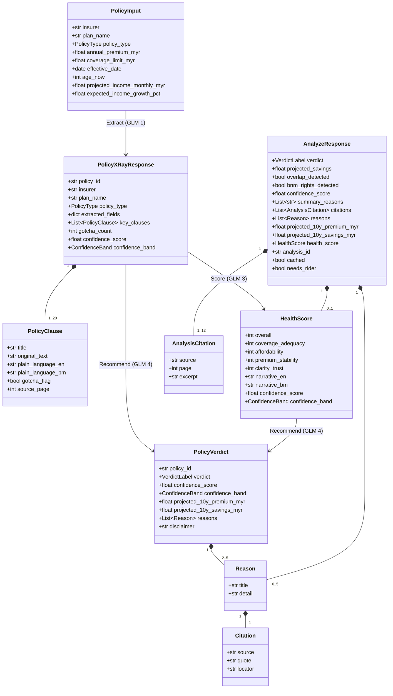
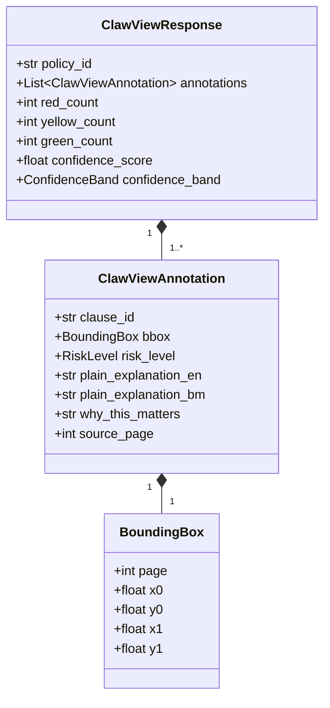
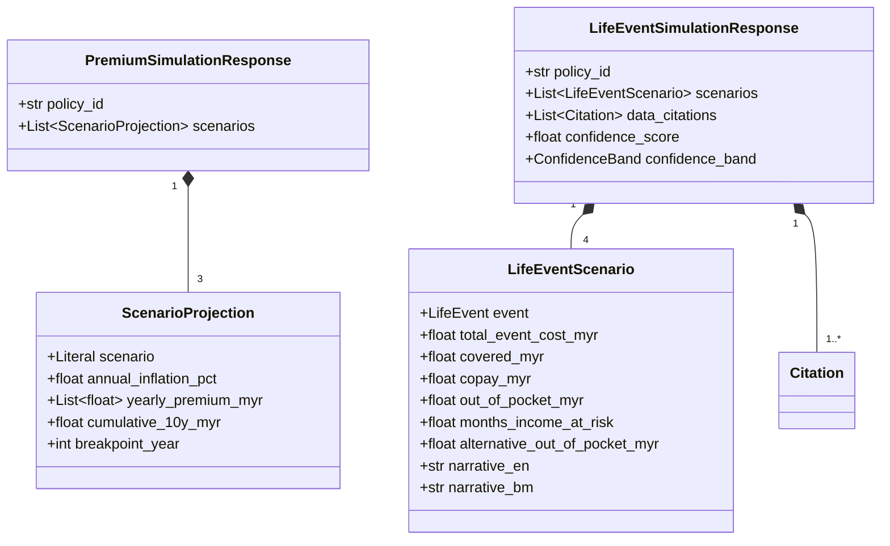

# PolicyClaw — Data Model (ERD)

Entity-relationship view of the Pydantic v2 schemas that flow between the
frontend, FastAPI backend, and the Ilmu GLM calls. These are the contracts
validated at every API boundary.

Source files: [`backend/app/schemas/`](../backend/app/schemas/).

---

## 1. Core contracts — `/api/analyze` pipeline

**Flow.** A user-supplied `PolicyInput` becomes a `PolicyXRayResponse`
(Extract), which feeds `HealthScore` (Score). Both flow into `PolicyVerdict`
(Recommend). The outer envelope delivered to the frontend is `AnalyzeResponse`.

---

## 2. ClawView (F4) — PDF risk overlay

`RiskLevel` is `GREEN | YELLOW | RED`. `red_count + yellow_count + green_count`
must equal `len(annotations)` — invariant enforced by Pydantic validators in
`clawview_service.py`.

---

## 3. FutureClaw (F6) — simulation outputs

Affordability emits exactly 3 scenarios (optimistic / realistic / pessimistic),
life-event exactly 4 (Cancer / Heart Attack / Disability / Death).

---

## 4. Shared enums

| Enum            | Values                                                        |
|-----------------|---------------------------------------------------------------|
| `PolicyType`    | `medical`, `life`, `critical_illness`, `takaful`, `other`     |
| `CoverageCategory` | `hospitalization`, `critical_illness`, `death_benefit`, `disability`, `outpatient`, `dental`, `maternity` |
| `ConfidenceBand` | `high` (≥80), `medium` (≥60), `low` (<60)                    |
| `VerdictLabel`  | `keep`, `downgrade`, `switch`, `dump`                         |
| `RiskLevel`     | `green`, `yellow`, `red`                                      |
| `LifeEvent`     | `cancer`, `heart_attack`, `disability`, `death`               |

---

## 5. Persistence note

MVP holds no durable state: extracted profiles live in browser `localStorage`
and demo-cache lookups are file-based (`backend/data/demo_cache/`). Supabase
(Postgres + Storage + pgvector) is the post-MVP ship target and is explicitly
non-MVP-gating per PRD §9.2. The schemas above are designed to map cleanly to
relational rows when that time comes.
